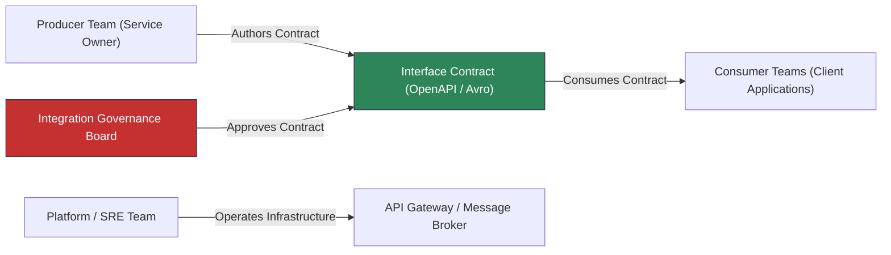
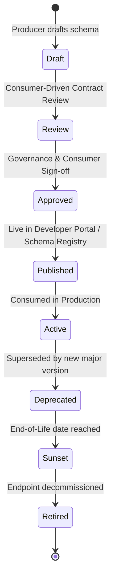

# Enterprise Integration Governance & Contract Lifecycle

## 1. Producer-Consumer Governance Model

Enterprise integrations frequently fail due to ambiguous ownership: When an API or event schema breaks, who is responsible?

Every integration interface must have explicit RACI ownership across four distinct roles:

| Role | Primary Responsibilities |
|---|---|
| **Producer (Contract Owner)** | Designs the schema, guarantees backward compatibility, provides sandbox mock stubs, and notifies consumers of planned evolutions. |
| **Consumer** | Adheres to published contract semantics, handles partial failures gracefully, and participates in consumer-driven contract tests. |
| **Integration Governance Board** | Validates alignment with canonical domain models, audits security/compliance controls, and mediates breaking change requests. |
| **Platform / SRE Team** | Maintains runtime infrastructure (API Gateways, Kafka clusters, mTLS PKI) and enforces SLA/SLO performance thresholds. |

---

## 2. Integration Contract Lifecycle

### Transition Gates & Rules
1. **Draft → Published**: Must pass automated schema linter (Spectral / Buf), backward-compatibility check, and security audit.
2. **Active → Deprecated**: Producer must issue formal deprecation notice. The API must return standard IETF headers:
   - `Deprecation: @<timestamp>`
   - `Sunset: <RFC1123 date>`
   - `Link: <successor URL>; rel="successor-version"`
3. **Deprecated → Retired**: Minimum deprecation window: 6 months for internal services, 12 months for external partner APIs.
