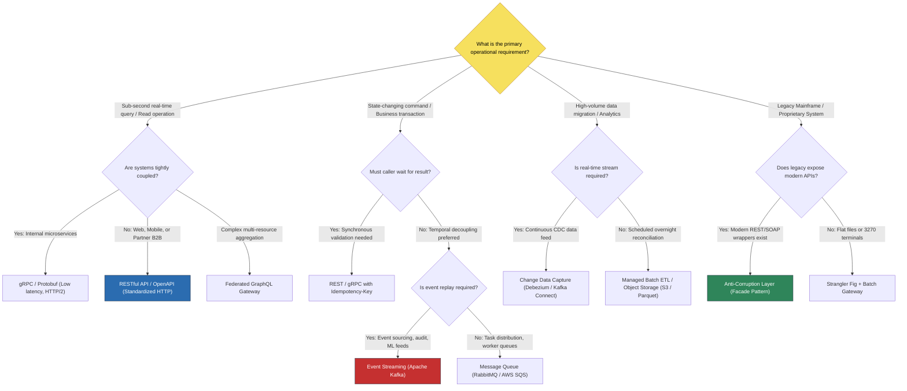

# Master Enterprise Integration Selection Guide

## 1. Decision Question: "Which Integration Pattern & Technology Should I Use?"

Selecting an integration architecture requires balancing latency, throughput, consistency, operational cost, and organizational boundaries.

---

## 2. Master Decision Tree

---

## 3. The 18 Architectural Integration Decision Questions

Before finalizing an enterprise integration design, the architect must document answers to these 18 questions:

1. **Data Ownership**: Who is the single authoritative System of Record (SoR) for each mutated entity?
2. **Temporal Coupling**: Does the initiating system require a blocking synchronous response, or can it accept an asynchronous receipt (`202 Accepted`)?
3. **Latency Envelope**: What is the strict latency budget (p95 and p99) for the end-to-end transaction?
4. **Volume & Throughput**: What are baseline, peak seasonal, and burst transaction volumes (RPS / TPS)?
5. **Availability Cascades**: If the downstream target system suffers an unplanned 2-hour outage, how does the upstream caller behave?
6. **Network Reliability**: Does the communication traverse the public internet, a corporate WAN, an AWS Direct Connect, or an in-cluster service mesh?
7. **Idempotency Guarantee**: How does the receiver identify and discard duplicate messages sent during network timeouts?
8. **Ordering Sensitivity**: Does the sequence of messages matter across partitions, or can records be processed out-of-order?
9. **Reconciliation Strategy**: How will discrepancies between source and target systems be discovered and corrected?
10. **Data Classification**: Does the payload contain PII, PCI cardholder data, PHI medical records, or sensitive corporate financials?
11. **Regulatory Mandates**: Which compliance regimes govern this boundary (PCI DSS, HIPAA, GDPR, PSD2, ISO 20022)?
12. **Protocol Heterogeneity**: Do the communicating systems share modern protocols, or is translation required (e.g., COBOL EBCDIC to UTF-8 JSON)?
13. **Transaction Scope**: Does the process span multiple independent systems requiring a distributed Saga pattern with compensating actions?
14. **Contract Governance**: Where is the machine-readable schema registered, and how are breaking changes detected prior to deployment?
15. **Operational Telemetry**: How will operations trace a transaction across all intermediate hops using correlation IDs?
16. **Legacy Constraints**: What are the batch window constraints, connection limits, and mainframe MIPS consumption costs?
17. **Vendor Guardrails**: What API rate limits, payload size limits, or licensing costs does the external vendor (e.g., Salesforce, SAP) impose?
18. **Evolution & Exit Strategy**: How can the target system be replaced in 3 years without rewriting the caller?
