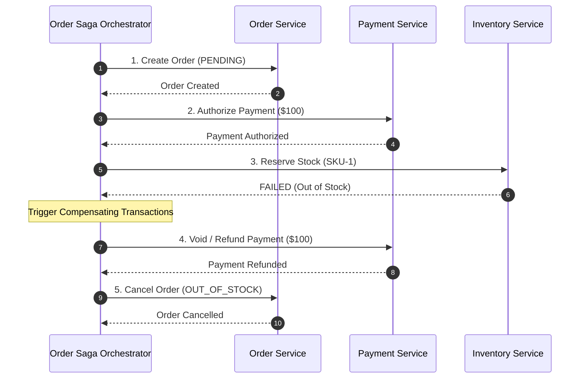

# Multi-System Distributed Transactions & Sagas

## 1. Why Two-Phase Commit (2PC) Fails in Modern Enterprises
Traditional distributed transactions (XA / 2PC) rely on locking database resources across all participating nodes until the transaction coordinator commits. 

In distributed, multi-cloud, or SaaS environments:
* SaaS systems (Salesforce, Stripe) do not expose XA lock interfaces.
* Network partitions cause indefinite row locking, causing cascading system-wide resource starvation.
* Microservices and autonomous databases violate the shared transaction coordinator model.

---

## 2. The Saga Pattern: Orchestration vs Choreography

### Compensating Transaction Invariants
1. **Semantic Reversal**: Compensations do not "undo" physical database commits; they execute an equal and opposite business action (e.g., executing a refund rather than erasing a ledger row).
2. **Mandatory Idempotency**: Compensating calls must be callable repeatedly without compounding side effects.
3. **No Failure on Compensation**: A compensating transaction MUST NOT fail permanently; it must retry indefinitely or route to an operator alert queue.
