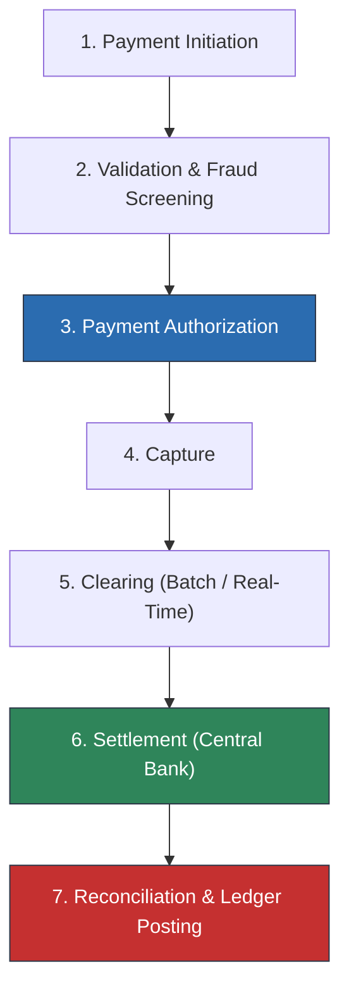

# Payment Platform Integration Architecture

## 1. Overview & Payment Lifecycle
A modern payment platform orchestrates value transfer across merchants, card networks, acquiring banks, issuing banks, and digital wallets.

---

## 2. Directory Contents
* **[payment-architecture.md](payment-architecture.md)** — Architectural styles: Payment gateway, orchestrator, switch.
* **[payment-lifecycle.md](payment-lifecycle.md)** — Detailed state machine across authorization, capture, and settlement.
* **[payment-initiation.md](payment-initiation.md)** — Payment intents, order binding, and checkout flows.
* **[authorization.md](authorization.md)** — 3D Secure 2 (3DS2), risk assessment, and card network authorizations.
* **[processing.md](processing.md)** — Routing engine, smart retry, and payment processor selection.
* **[clearing.md](clearing.md)** — Batch exchange of financial records between acquirer and issuer.
* **[settlement.md](settlement.md)** — Interbank fund transfer and merchant payout scheduling.
* **[reconciliation.md](reconciliation.md)** — Three-way reconciliation (Merchant vs Gateway vs Bank statement).
* **[refunds.md](refunds.md)** — Full vs partial refunds, state machines, and fee handling.
* **[chargebacks.md](chargebacks.md)** — Dispute lifecycle, representment evidence, and liability shifts.
* **[fraud.md](fraud.md)** — Device fingerprinting, velocity checks, and machine learning scoring.
* **[idempotency.md](idempotency.md)** — Eliminating duplicate charges via `Idempotency-Key` headers.
* **[duplicate-prevention.md](duplicate-prevention.md)** — Distributed mutex locking and database unique constraints.
* **[payment-ledger.md](payment-ledger.md)** — Immutable double-entry transaction ledger architecture.
* **[external-processors.md](external-processors.md)** — Integrating Stripe, Adyen, Worldpay, PayPal, and Apple Pay.
* **[payment-gateways.md](payment-gateways.md)** — Payment gateway ingress, tokenization, and PCI scoping.
* **[payment-events.md](payment-events.md)** — CloudEvents schemas for payment lifecycle streaming.
* **[failure-handling.md](failure-handling.md)** — Handling network drops, processor 5xx, and card declines.
* **[security.md](security.md)** — Hardware Security Modules (HSMs) and field-level encryption.
* **[pci-dss.md](pci-dss.md)** — Architectural requirements for PCI DSS compliance (see subfolder).
* **[observability.md](observability.md)** — Authorization rates, decline codes, and payment latency APM.
* **[reference-architecture.md](reference-architecture.md)** — Global Multi-Processor Payment Reference Architecture.
* **[examples/payment-orchestration-engine.md](examples/payment-orchestration-engine.md)** — Multi-Acquirer Smart Routing Engine example.
