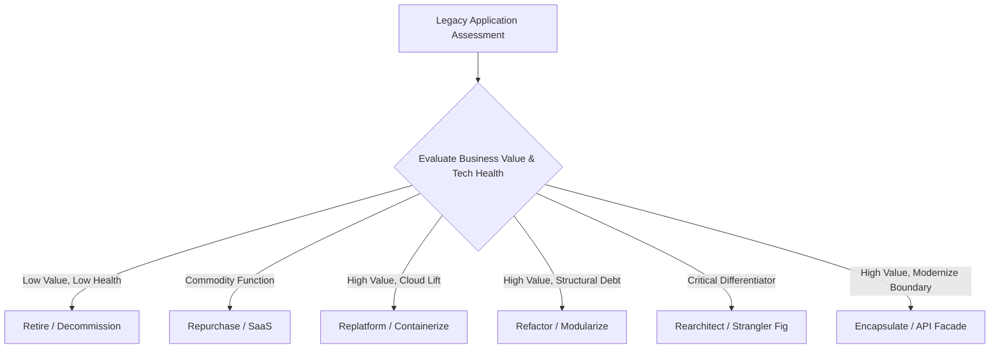

# Enterprise Application Modernization Architecture

Enterprise application modernization is the systematic evolution of legacy software architectures into cloud-ready, scalable, secure, and maintainable systems aligned with business velocity.

---

## The 6Rs Modernization Strategy Matrix

---

## Knowledge Index
- [Legacy Application Assessment](legacy-application-assessment.md)
- [Application Health Assessment](application-health-assessment.md)
- [Codebase Assessment](codebase-assessment.md)
- [Dependency Assessment](dependency-assessment.md)
- [Architecture Assessment](architecture-assessment.md)
- [Modernization Options: The 6Rs Framework](modernization-options.md)
- [Refactor Architecture Strategy](refactor.md)
- [Replatform Strategy](replatform.md)
- [Rewrite Strategy: When & How](rewrite.md)
- [Rearchitect Strategy](rearchitect.md)
- [Retire & Decommission Strategy](retire.md)
- [Encapsulate Strategy](encapsulate.md)
- [Strangler Fig Pattern Implementation](strangler-pattern.md)
- [Incremental Modernization Playbook](incremental-modernization.md)
- [Modernization Risk Management](modernization-risk.md)
- [Modernization Roadmap & Governance](modernization-roadmap.md)
