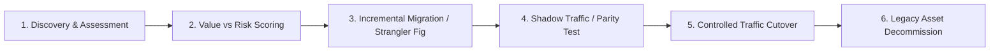

# Modernization Architecture: Strangler Fig Pattern Architecture

## 1. Architectural Purpose & Executive Context
Progressively replacing legacy functionality with micro-features routed via an API gateway or reverse proxy.

---

## 2. Strategic Modernization Flow

---

## 3. Production Invariants & Governance Rules
- Never attempt multi-year "big-bang" rewrites without iterative, testable production milestones.
- Employ dark launching, feature toggles, and shadow traffic validation before switching primary write traffic.
- Protect business continuity: every modernization step must have a concrete, instant rollback plan.
