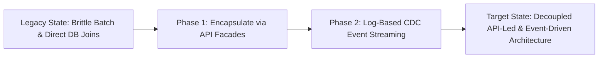

# Modernization: Legacy Batch to Real-Time Event Streaming Modernization

## 1. Architectural Purpose & Problem Context
Transitioning nightly batch processing windows into continuous micro-batch and real-time Kafka streaming without breaking business reporting.

---

## 2. Modernization Evolution Trajectory

---

## 3. Production Invariants
- Modernization must be incremental and evolutionary; multi-year 'big-bang' replacements have an industry failure rate exceeding 70%.
- Maintain automated parity testing and bidirectional data synchronization during the transition period.
