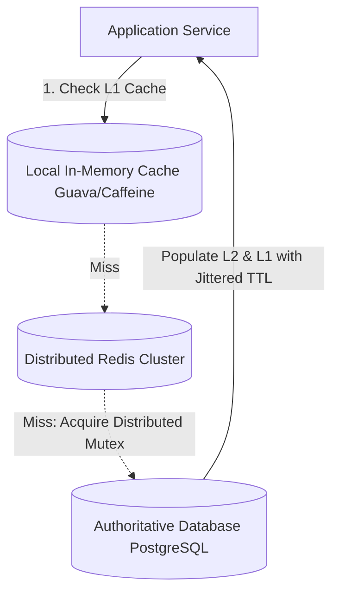

# Architecture Modernization: Cache Introduction Strategy

## 1. Architectural Objective & Context

Safely introduce a distributed caching layer (e.g., Redis cluster) into an existing read-heavy enterprise system without inducing cache stampedes, stale read anomalies, or database connection avalanches during cache warm-up.

---

## 2. Architectural Blueprint: Multi-Level Cache-Aside



---

## 3. Implementation Playbook & Rollout Phases

### Phase 1: Shadow Caching & Hit Rate Telemetry
- Deploy Redis nodes in read-only passive mode.
- The application executes queries against the database normally, but copies results to Redis asynchronously without serving reads from the cache.
- Validate memory utilization, serialization performance, and key evictions in production.

### Phase 2: Canary Read Activation
- Enable cache reads for 5% of application servers.
- Monitor database query offload percentage and verify data consistency between cached objects and direct database reads.

### Phase 3: Cache Stampede Mitigation
- Protect the database from thunderous herds when hot keys expire:
  - **Probabilistic Early Expiration (XFetch)**: Compute early refresh probability based on remaining TTL and execution compute time.
  - **Distributed Mutex (Single-Flight)**: Ensure only one thread executes the database query on a cache miss; other concurrent threads wait for the lock holder to populate the cache.

---

## 4. Production Considerations & Guardrails

```
+--------------------------+-------------------------------------------------+
| Anomaly                  | Architectural Defense                           |
+--------------------------+-------------------------------------------------+
| Cache Penetration        | Bloom filter + Cache Null Objects with 60s TTL  |
| Cache Avalanche          | Add randomized jitter (e.g., TTL = 3600s + rand)|
| Database Stale Reads     | Invalidate cache atomically via CDC / Outbox    |
+--------------------------+-------------------------------------------------+
```
