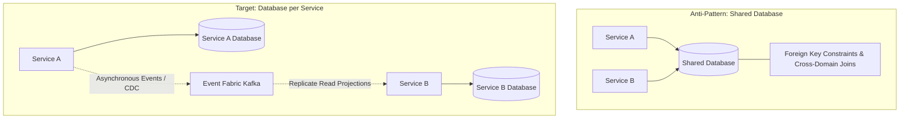
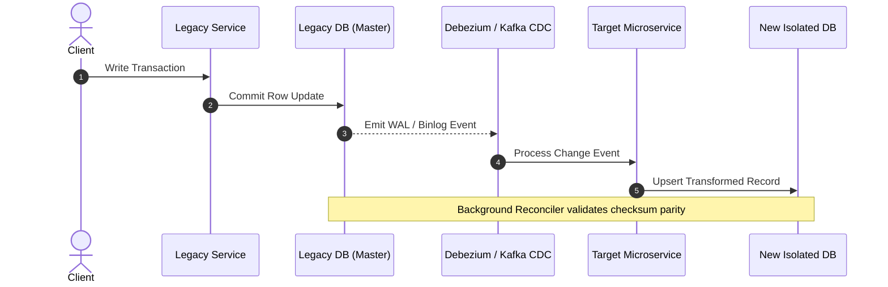

# Architecture Modernization: Database Decomposition

## 1. Architectural Objective & Context

Decompose a massive, centralized monolithic relational database into autonomous, isolated databases aligned with microservice boundaries (Database-per-Service pattern) while preserving data integrity and avoiding distributed lock contention.

---

## 2. Legacy vs Target Architecture



---

## 3. Step-by-Step Transition Strategy

```
Step 1: Logical Separation (Views & Schemas in Single DB)
  └─► Step 2: Break Foreign Keys & Triggers in Application Code
        └─► Step 3: Dual-Write & Change Data Capture (CDC)
              └─► Step 4: Shadow Read & Parity Verification
                    └─► Step 5: Master Cutover to New Database
```

### The CDC & Dual-Write Pattern
To migrate data without downtime:
1. Initialize CDC engine (e.g., Debezium reading MySQL binlog or PostgreSQL WAL).
2. Take a point-in-time snapshot of the legacy tables and hydrate the new service database.
3. Stream incremental transaction logs to apply delta changes.
4. Run an automated background reconciler comparing primary keys and row checksums.



---

## 4. Handling Cross-Domain Joins & Foreign Keys

### A. CQRS & Read Projections
Instead of joining across schemas, Service B consumes domain events from Service A (e.g., `CustomerUpdated`) and maintains a denormalized local projection of the customer metadata needed for its local operations.

### B. API Composition (Gateway Aggregation)
For user-facing screens requiring aggregated data from both domains, the API Gateway or Backend-For-Frontend (BFF) invokes both services in parallel and merges the JSON payloads before returning.

---

## 5. Production Considerations & Failure Modes

1. **Replication Lag Handling**: During CDC streaming, target databases may lag by tens to hundreds of milliseconds. Clients reading immediately after writing must route through the primary source until cutover.
2. **Reconciliation Audits**: Implement hash-bucket verification comparing MD5 row hashes between source and target databases continuously until 0 delta is achieved for 72 consecutive hours.
