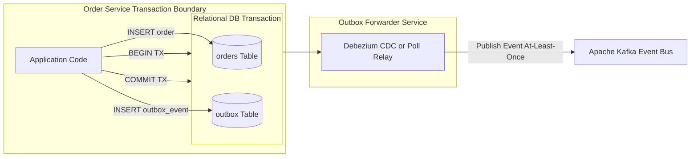

# Architecture Modernization: Synchronous to Event-Driven Migration

## 1. Architectural Objective & Context

Transition an enterprise estate plagued by synchronous HTTP/REST call cascades, high coupling, and cascading timeouts into an asynchronous, decoupled event-driven architecture using Kafka/RabbitMQ and the Transactional Outbox pattern.

---

## 2. Legacy vs Target Architecture

```mermaid
flowchart TB
    subgraph LegacySync [Legacy Cascading Synchronous Calls]
        OrderLegacy[Order Service] -->|HTTP POST (Block)| PayLegacy[Payment Service]
        PayLegacy -->|HTTP POST (Block)| InvLegacy[Inventory Service]
        InvLegacy -->|HTTP POST (Block)| NotifLegacy[Email Service]
    end

    subgraph ModernEDA [Target Event-Driven Choreography]
        OrderModern[Order Service] -->|1. Commit DB & Outbox| OrderDB[(Order DB)]
        OrderModern -->|2. Publish Event| KafkaBus[Event Fabric Kafka]
        KafkaBus -->|3. Consume async| PayModern[Payment Service]
        KafkaBus -->|3. Consume async| InvModern[Inventory Service]
        KafkaBus -->|3. Consume async| NotifModern[Notification Service]
    end
```

---

## 3. Core Modernization Mechanism: The Transactional Outbox Pattern

Directly publishing to a message broker inside an application transaction causes the **Dual-Write Problem**: if the database commit succeeds but the message broker publish fails (or vice versa), the system enters an inconsistent state.



---

## 4. Step-by-Step Transition Roadmap

1. **Schema Definition**: Standardize event schemas using Apache Avro or Protocol Buffers in a central Schema Registry.
2. **Outbox Implementation**: Introduce the `outbox` table into the legacy service; write local business state and outbox events in a single local ACID transaction.
3. **Dual Running**: Maintain existing synchronous HTTP endpoints while simultaneously emitting events to the broker.
4. **Consumer Onboarding**: Build downstream microservices as idempotent event consumers listening to the Kafka topics.
5. **Decommission Sync Calls**: Disable HTTP inter-service RPC calls once consumers demonstrate 100% processing parity.

---

## 5. Production Guardrails & Resiliency

- **Idempotent Consumers**: Every event consumer must record processed `event_id` keys in an atomic deduplication store (Redis or local SQL unique index).
- **Dead-Letter Queues (DLQ)**: Poison messages failing processing after exponential retry policies are routed to a persistent DLQ with automated alerting.
