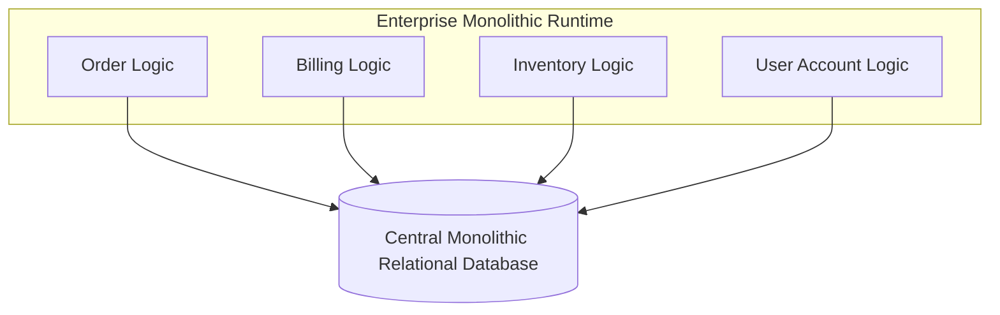
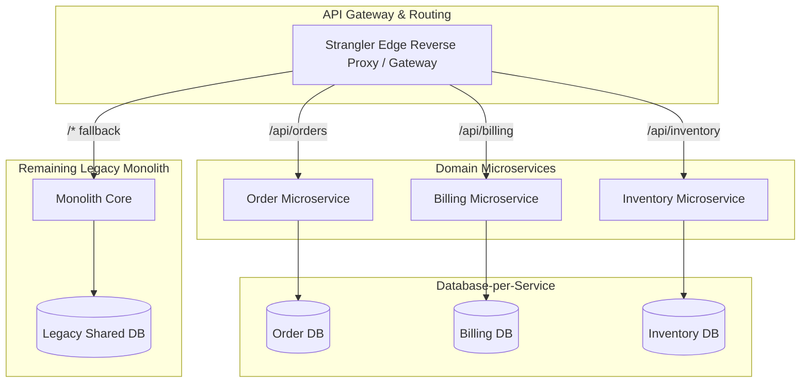

# Architecture Modernization: Monolith to Microservices

## 1. Architectural Objective & Context

Transition a monolithic enterprise application experiencing team scaling bottlenecks, slow release cycles (months), and deployment risk into an independently deployable, domain-aligned microservices architecture without halting feature development or risking business disruption.

---

## 2. Legacy Architecture State & Structural Bottlenecks



- **Shared Memory & In-Process Coupling**: Cross-module method calls with direct access to objects across arbitrary domain boundaries.
- **Relational Table Joins**: Queries join across 15+ domain tables, entangling schemas.
- **Single Blast Radius**: A memory leak or runaway transaction in billing crashes the entire ordering application.

---

## 3. Target Microservices Architecture



---

## 4. Phased Transition Roadmap

### Phase 0: Domain Modeling & Internal Modularization
- Perform **Event Storming** to identify Domain-Driven Design (DDD) Bounded Contexts.
- Refactor the monolith internally into modular sub-packages with strict package visibility; eliminate direct database joins across modules by introducing in-memory facade interfaces.

### Phase 1: Edge Proxy & Peripheral Extraction
- Deploy an API Gateway / Edge Reverse Proxy in front of the monolith.
- Extract the lowest-risk peripheral domain (e.g., Notification or Review service) first to validate CI/CD pipelines, container orchestration, and observability meshes.

### Phase 2: Core Domain Extraction & Data Shadowing
- Extract high-value core services (e.g., Billing or Ordering).
- Implement asynchronous data replication from the Monolith DB to the new Service DB via Change Data Capture (Debezium/Kafka).
- Route read-only traffic to the new service in "shadow mode" (compare output against monolith without returning to client).

### Phase 3: Traffic Cutover & Legacy Deprecation
- Shift 100% of live traffic for the extracted domain through the API Gateway to the new microservice.
- Reverse the CDC replication stream (Service DB $\rightarrow$ Legacy DB) to keep remaining monolithic modules functioning until they too are extracted.

---

## 5. Rollback & Fallback Mechanisms

```
+--------------------------+-------------------------------------------------+
| Failure Trigger          | Automated Fallback Action                       |
+--------------------------+-------------------------------------------------+
| Error Rate Spike > 1%    | Gateway dynamically routes back to legacy path  |
| Data Divergence Detected | Circuit breaker trips; writes revert to Monolith|
| High Latency P99 > 1s    | Drain microservice traffic, scale down replica  |
+--------------------------+-------------------------------------------------+
```

---

## 6. Production Considerations & Antipatterns

1. **Avoid the "Distributed Monolith"**: If Service A cannot complete a write without making synchronous blocking HTTP calls to Service B, C, and D, you have built a slower, fragile distributed monolith. Use event-driven choreography.
2. **Never Share Databases Across Microservices**: Direct cross-service database access breaks encapsulation, prevents schema evolution, and recreates the monolithic bottleneck.
