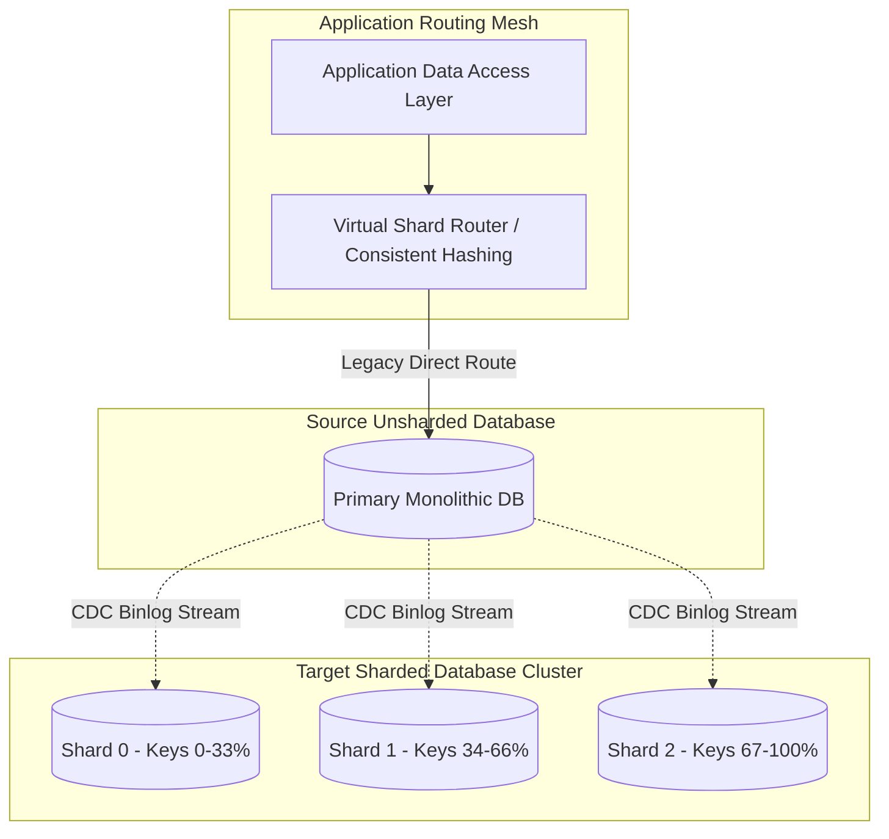

# Architecture Modernization: Database Sharding Migration

## 1. Architectural Objective & Context

Transition an un-sharded monolithic database hitting write throughput limits, storage constraints, and IOPS bottlenecks into a horizontally partitioned (sharded) database cluster without taking down the application or corrupting relational state.

---

## 2. Migration Architecture Topology

---

## 3. Step-by-Step Sharding Migration Phases

### Phase 1: Shard Key Selection & Schema Isolation
- Select a shard key with high cardinality and uniform write distribution (e.g., `tenant_id` or `user_id`).
- Eliminate cross-table joins that do not include the shard key; convert foreign-key constraints into application-level validation.

### Phase 2: Dual-Write & Incremental Replication
- Provision target shard nodes.
- Run a baseline bulk snapshot copy from the monolith database to the shards, filtering records by shard key hash ranges.
- Attach an asynchronous CDC replication pipeline (Kafka + Debezium) to continuously stream live updates to the destination shards.

### Phase 3: Shadow Verification
- The application executes read queries against both the primary monolith and the target shards.
- Discrepancies are flagged in real-time metrics dashboards without blocking user responses.

### Phase 4: Atomic Cutover
- Briefly pause inbound writes (or queue them via an API Gateway message buffer for < 5 seconds).
- Catch up the final replication log delta.
- Repoint application database connections to the sharded cluster and resume writes.

---

## 4. Operational Guardrails & Failure Mitigations

- **Cross-Shard Queries**: Strictly prohibit queries spanning multiple shards in OLTP paths. Any cross-shard analytical reporting must be served from a read replica or data lake.
- **Shard Resharding**: Utilize virtual nodes (e.g., 1024 virtual buckets mapped to physical hosts) so scaling from 4 to 8 physical databases requires moving virtual buckets rather than recomputing every row.
