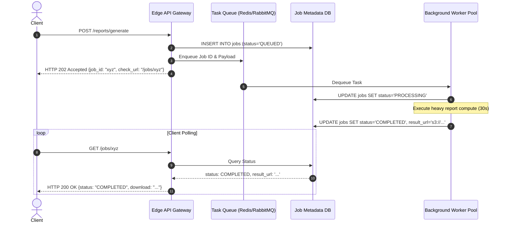

# Architecture Modernization: Synchronous to Asynchronous Processing

## 1. Architectural Objective & Context

Eliminate long-running synchronous HTTP requests that tie up web server threads, exhaust database connection pools, and degrade user experience during heavy processing (e.g., report generation, document parsing, bulk batch operations).

---

## 2. Legacy Problem Topology

```
User Browser ───[HTTP Request]───► Web Server (Thread Locked 45s) ───► Heavy Compute
                                           ▲
                                           │ (Connection pool starved;
                                           │  HTTP 504 Gateway Timeout)
```

---

## 3. Target Asynchronous Job Pattern

Transition to an asynchronous job polling / webhook model:
1. The client issues a `POST /jobs` request.
2. The server creates a job record with status `PENDING`, pushes the task payload to a persistent queue, and immediately returns `HTTP 202 Accepted` with a `Location: /jobs/{job_id}` header.
3. Decoupled worker processes consume tasks from the queue and update the job status in durable storage upon completion.
4. The client polls the status endpoint or receives a WebSocket/SSE push notification when the job reaches `COMPLETED`.



---

## 4. Production Considerations

- **TTL & Expiration**: Expire job result tokens and temporary download URLs after 24–48 hours to prevent storage bloat.
- **Backpressure & Concurrency Limits**: Cap worker thread pool concurrency to protect downstream storage engines from being overwhelmed during batch bursts.
