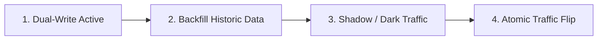

# Architecture Modernization: Zero-Downtime Data & Traffic Migration

## 1. Architectural Objective & Context

Migrate active production traffic and persistent data from a legacy software system to a modern platform with zero user-perceived downtime, zero data loss, and complete rollback capability.

---

## 2. The 4-Phase Migration Lifecycle

### Phase 1: Dual-Write Activation
- The application begins writing all new mutations to **both** the Legacy Store (authoritative) and the Target Store.
- Target writes are wrapped in non-blocking try-catch blocks or background threads to prevent target errors from failing user requests.

### Phase 2: Historical Data Backfill
- A background worker scans the Legacy Store from the beginning of time up to the timestamp where Dual-Write was activated.
- Conflicts are resolved using idempotent upsert operations where newer timestamps always overwrite older records.

### Phase 3: Shadow / Dark Traffic Validation
- The Edge Gateway duplicates incoming read requests. The primary request is served by the legacy system, while a cloned request is sent to the target system.
- An asynchronous comparator verifies that both systems return identical HTTP status codes and payloads.

### Phase 4: Canary Cutover & Reversal
- Shift 1%, 5%, 25%, 50%, 100% of read/write traffic to the new system.
- Reverse the dual-write: the target system becomes authoritative, writing back to the legacy system as a safety fallback.

---

## 3. Rollback Playbook

If a critical flaw emerges during Phase 4:
1. Shift gateway traffic routing back to 100% legacy within seconds via dynamic DNS or CDN edge rules.
2. Because reverse dual-writing was maintained, the legacy system holds all transactions that occurred while the new system was active. Zero data is lost.
