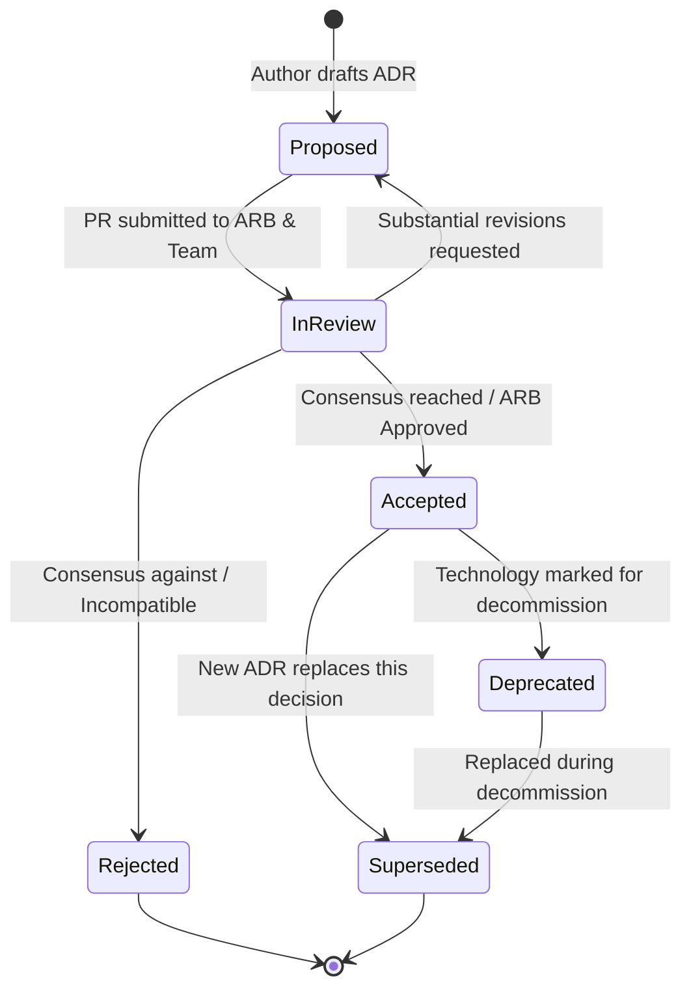

# ADR Lifecycle Governance

## 1. State Machine



---

## 2. Transition Rules

### 2.1 Proposed $
ightarrow$ Accepted
* An ADR transitions to `Accepted` only after:
  1. Completion of peer review by impacted engineering teams.
  2. Formal sign-off by the Lead / Solution Architect.
  3. Security and Data Architecture approval (where applicable).

### 2.2 Accepted $
ightarrow$ Superseded
* Never edit an accepted ADR to change historical decisions.
* When replacing an architectural choice:
  1. Author a new ADR (e.g., `ADR-0085`).
  2. In `ADR-0085`, set `Related ADRs: Supersedes ADR-0021`.
  3. Update `ADR-0021` metadata: Set `Status: Superseded` and add a notice:
     ```markdown
     > [!WARNING]
     > **SUPERSEDED**: This decision was superseded on YYYY-MM-DD by `[ADR-0085](template.md)`.
     ```

### 2.3 Proposed $
ightarrow$ Rejected
* If an option is evaluated but deemed unviable, mark it `Rejected` and document the exact reasons.
* **Keep rejected ADRs in the repository!** They are invaluable for preventing future teams from repeating failed experiments.
