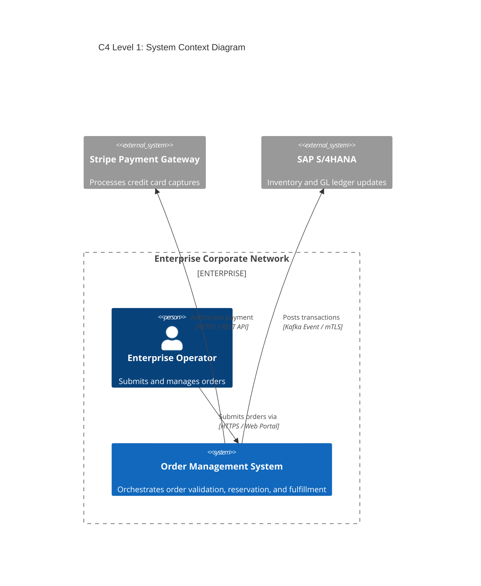
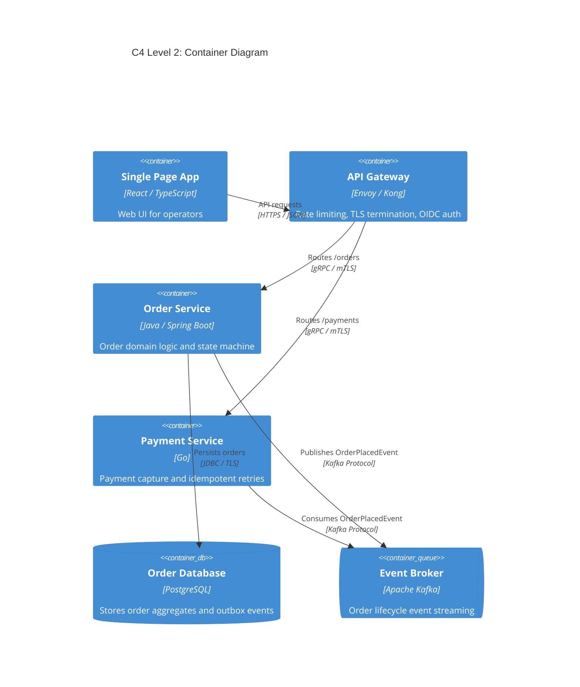

# Architecture Overview & C4 Model Specification

## 1. System Context View (C4 Level 1)
Details the software system within the enterprise environment, identifying external users, third-party systems, and institutional boundaries.

---

## 2. Container View (C4 Level 2)
Decomposes the system into high-level deployable containers (applications, databases, message queues).

