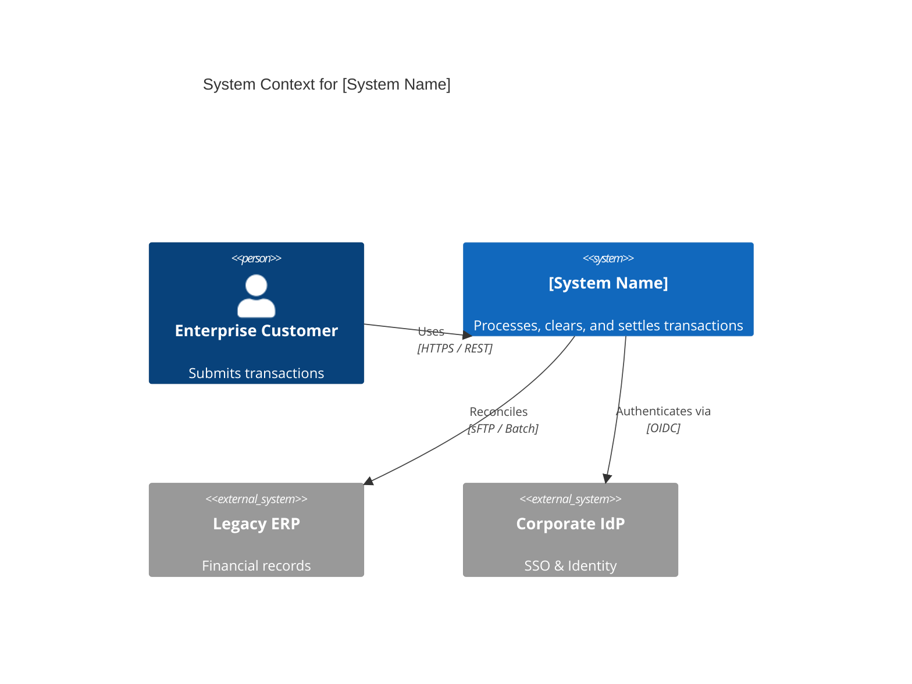

# Solution Architecture Document (SAD): [SYSTEM NAME]

---
**Document Metadata**:
```yaml
document_id: "SAD-[PROJECT-ID]"
title: "Solution Architecture Document — [System Name]"
version: "1.0.0"
status: "Draft" # Draft | In Review | Approved | Implemented | Superseded
owner: "[Lead Solution Architect Name <email>]"
reviewers:
  - "Security Architect: [Name]"
  - "Data Architect: [Name]"
  - "Lead Infrastructure Engineer: [Name]"
  - "ARB Sign-Off: [Board Chair Name]"
created_date: "YYYY-MM-DD"
last_updated: "YYYY-MM-DD"
next_review_date: "YYYY-MM-DD"
related_adrs:
  - "ADR-0001: [Title]"
```
---

## 1. Executive Summary
Brief high-level overview explaining the business problem, proposed technical solution, major decisions, and key outcomes. Target audience: Engineering leadership and ARB members.

## 2. Business Context & Drivers
* **Business Capabilities**: What business capabilities are created or enhanced?
* **Strategic Alignment**: How does this initiative support corporate OKRs?
* **Key Stakeholders**: Business sponsors, product owners, regulatory officers.

## 3. Scope Boundaries
### 3.1 In Scope
* [Explicit capability or subsystem 1]
* [Explicit capability or subsystem 2]

### 3.2 Out of Scope
* [Explicitly deferred or excluded feature 1]
* [Capabilities handled by legacy systems]

## 4. Requirements Baseline
* **Functional Requirements**: Hyperlink to [[14-requirements/](../14-requirements/README.md)].
* **Non-Functional Requirements**: Hyperlink to [[15-nfr/](../15-nfr/README.md)] (Performance, Availability, RTO/RPO).

## 5. Architectural Principles & Constraints
* Principle 1: Cloud-first, containerized workloads.
* Principle 2: Zero Trust network architecture across all inter-service traffic.
* Constraint 1: Must support existing legacy Oracle ERP for nightly reconciliation.

## 6. Architecture Overview & Context Model
Reference C4 System Context diagram from [[17-diagrams/01-c4-model/01-context.md](../../17-diagrams/c4/context.md)].



## 7. Logical & Application Architecture
Decompose the system into its primary subsystems, services, and modules.
* Core Services and responsibilities.
* Inter-service communication patterns (Sync vs Async). Reference [[01-adr/examples/synchronous-vs-asynchronous.md](../01-adr/examples/synchronous-vs-asynchronous.md)].

## 8. Data Architecture & Persistence
* Master data stores, databases, and caches. Reference [[06-data-design/](../06-data-design/README.md)].
* Consistency models (ACID vs Eventual Consistency).
* Data classification, retention, and GDPR/PII handling.

## 9. Integration Architecture
* External APIs, webhooks, partner connectors. Reference [[07-integration-design/](../07-integration-design/README.md)].
* Event streams, message brokers, and dead-letter queue policies.

## 10. Security Architecture
* Identity, Authentication (OIDC/OAuth2), and Authorization (RBAC/ABAC).
* Trust boundaries and threat modeling. Reference [[08-security-design/](../08-security-design/README.md)].
* Cryptography: TLS 1.3 in transit, AES-256-GCM at rest, KMS key lifecycle.

## 11. Deployment & Infrastructure Architecture
* Cloud provider, compute platform (Kubernetes / ECS / Serverless).
* Network topology: VPCs, public/private subnets, transit gateways. Reference [[09-deployment-design/](../09-deployment-design/README.md)].

## 12. Scalability, Availability & Resilience
* Horizontal autoscaling triggers (CPU, memory, queue depth).
* Multi-Availability Zone and Multi-Region deployment topology.
* High Availability targets (e.g., 99.99% uptime).

## 13. Disaster Recovery & Business Continuity
* Recovery Point Objective (RPO) and Recovery Time Objective (RTO).
* Backup cadence, cross-region replication, and failover automation. Reference [[18-disaster-recovery/](../18-disaster-recovery/README.md)].

## 14. Observability & Telemetry
* Metrics (Prometheus / Datadog), distributed tracing (OpenTelemetry), centralized structured logging.
* Golden signals (Latency, Traffic, Errors, Saturation).

## 15. Operational Architecture & Runbooks
* Operational readiness, on-call support model, and emergency runbooks. Reference [[19-operational-readiness/](../19-operational-readiness/README.md)].

## 16. Total Cost of Ownership (TCO) & FinOps
* Projected monthly cloud infrastructure costs.
* Compute, database, network egress, and software license estimates.

## 17. Architecture Decisions (ADR Register)
List of all key ADRs underpinning this architecture:
* [ADR-0001: Architectural Style](../01-adr/examples/monolith-vs-microservices.md)
* [ADR-0002: Persistence Selection](../01-adr/examples/database-selection.md)

## 18. Risk Register & Mitigations
Link to active [[11-risk-register/](../11-risk-register/README.md)].
* Technical risk 1 and contingency plan.

## 19. Migration & Transition Strategy
Phased rollout waves, Strangler Fig pattern, or cutover plan. Reference [[16-migration-plan/](../16-migration-plan/README.md)].

## 20. Open Questions & Decision Log
* Unresolved technical investigations or POCs currently in flight.

## 21. Document History & Approvals
| Version | Date | Author | Description of Change | Approved By |
|---|---|---|---|---|
| 0.1 | YYYY-MM-DD | [Author] | Initial Architecture Draft | Pending Review |
| 1.0 | YYYY-MM-DD | [Author] | ARB Approved Production Baseline | ARB Board |
