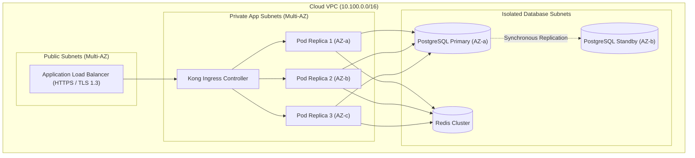

# HLD Deployment & Infrastructure Overview

## 1. Runtime Topology

## 2. Resource Specifications
* **CPU Requests / Limits**: 500m / 2000m.
* **Memory Requests / Limits**: 1024Mi / 2048Mi.
* **Horizontal Pod Autoscaler (HPA)**: Min 3 replicas, Max 30 replicas; target average CPU 70%.
