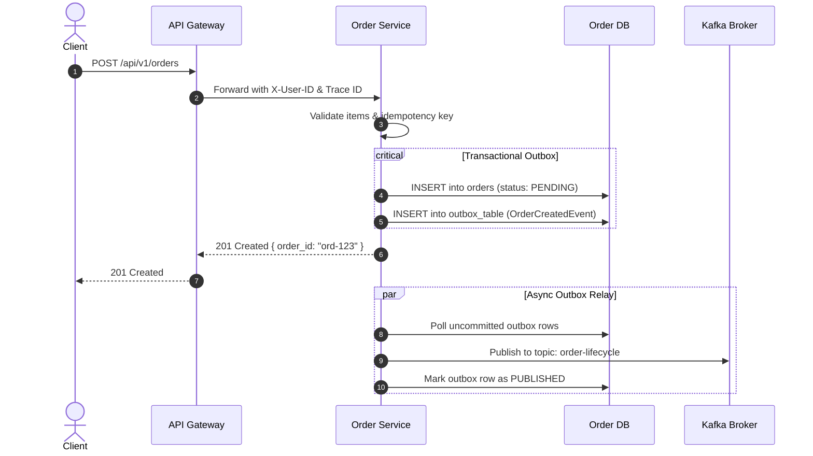

# HLD Integration & Interface Overview

## 1. Upstream & Downstream Dependencies
| Integration Point | Type | Protocol | Payload | SLA Target |
|---|---|---|---|---|
| **Client Gateway** | Inbound | HTTPS / REST | JSON (OpenAPI 3.1) | 99.95% Availability |
| **Inventory Service** | Outbound | gRPC / HTTP/2 | Protobuf v3 | p95 < 25ms |
| **Payment Gateway** | Outbound | HTTPS / REST | JSON | p95 < 800ms |
| **Event Stream** | Outbound | Kafka Producer | Avro with Schema Registry | Guaranteed Delivery |

## 2. Sequence Diagram: Order Placement Flow
Reference UML Sequence specs from [[17-diagrams/02-uml/02-sequence-diagrams.md](../../17-diagrams/sequence/order-processing.md)].

