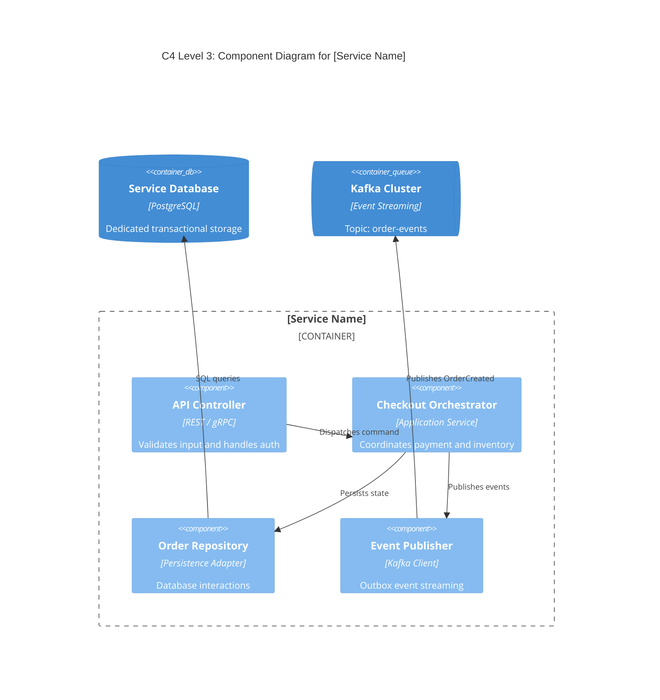

# High-Level Design (HLD): [SERVICE / SUBSYSTEM NAME]

---
**Document Metadata**:
```yaml
document_id: "HLD-[SUBSYSTEM-ID]"
title: "High-Level Design — [Subsystem / Service Name]"
version: "1.0.0"
status: "Draft" # Draft | In Review | Approved | Implemented | Superseded
owner: "[Technical Architect / Lead Engineer Name <email>]"
parent_sad: "SAD-[PROJECT-ID]" # Reference to parent Solution Architecture Document
reviewers:
  - "Solution Architect: [Name]"
  - "Staff Engineer: [Name]"
  - "Security Architect: [Name]"
created_date: "YYYY-MM-DD"
last_updated: "YYYY-MM-DD"
next_review_date: "YYYY-MM-DD"
```
---

## 1. System Scope & Context
* **Subsystem Objective**: What specific domain capability does this service own?
* **Parent System Context**: How does this service fit into the overarching platform? Reference [[02-sad/template.md](../02-sad/template.md)].
* **In-Scope / Out-of-Scope**: Explicit boundaries of responsibility.

## 2. Requirements & NFR Traceability
* Functional Requirements: [REQ-001, REQ-002]
* Key NFRs:
  - Latency: p95 < 150ms under 5,000 RPS.
  - Availability: 99.95% uptime.
  - RPO/RTO: RPO = 0, RTO < 60s.

## 3. Architecture Context & C4 Component Model
Reference canonical C4 Component diagrams from [[17-diagrams/01-c4-model/03-component.md](../../17-diagrams/c4/component.md)].



## 4. Subsystem Components & Responsibilities
| Component Name | Primary Responsibility | Exposed Interface | Upstream / Downstream Callers |
|---|---|---|---|
| **API Controller** | HTTP/gRPC parsing, input sanitization, JWT auth | POST /orders | API Gateway |
| **Command Orchestrator** | Business rule validation, saga state transitions | Internal Go/Java Interface | API Controller |
| **Outbox Relay** | Guarantees at-least-once event delivery | Background Goroutine / Debezium | Service Database $
ightarrow$ Kafka |

## 5. Inbound & Outbound Interfaces (APIs)
* **Inbound Endpoints**: Reference OpenAPI specification in [[05-api-design/](../05-api-design/README.md)].
* **Outbound Dependencies**: Downstream third-party or internal RPC calls.

## 6. Data Storage & Schema Design
* Dedicated database engine, table schemas, primary keys, and indexes. Reference [[06-data-design/](../06-data-design/README.md)].
* Transactional boundaries and isolation levels (Read Committed / Serializable).

## 7. Event & Messaging Architecture
* Published Events (Topics, schemas, serialization format like Avro / Protobuf).
* Subscribed Events (Dead-letter queue handling, consumer lag mitigations). Reference [[07-integration-design/](../07-integration-design/README.md)].

## 8. Security Boundaries & Controls
* Authentication: JWT bearer token validation via public keys.
* Authorization: RBAC / fine-grained scope verification (`orders:write`).
* Network Segmentation: Private VPC subnet with egress only to approved endpoints. Reference [[08-security-design/](../08-security-design/README.md)].

## 9. Scalability & Runtime Deployment
* Container specifications: Kubernetes Pod resources (Requests/Limits).
* Autoscaling policy: Horizontal Pod Autoscaler (HPA) targeting 70% CPU or queue depth.
* Deployment topology: Multi-AZ across 3 zones. Reference [[09-deployment-design/](../09-deployment-design/README.md)].

## 10. Resilience, Failover & Error Handling
* Downstream failure mitigations: Circuit Breakers (Resilience4j / Istio), timeouts (500ms max), exponential backoff retries.
* Idempotency handling: Client-provided `Idempotency-Key` header with Redis locks.

## 11. Observability & Telemetry
* Golden signals: RPS counter, 4xx/5xx error rates, p50/p95/p99 latency histograms.
* Distributed Tracing: W3C traceparent propagation via OpenTelemetry SDK.
* Structured Logging: JSON formatted logs with `trace_id`, `span_id`, and `user_id` (PII redacted).

## 12. Technical Decisions & ADR Reference
* [ADR-0003: Apache Kafka for Event Streaming](../01-adr/examples/messaging-selection.md)
* [ADR-0004: Asynchronous Order Choreography](../01-adr/examples/synchronous-vs-asynchronous.md)

## 13. Open Questions & Risks
* Items requiring benchmarking or spike investigations prior to LLD approval.
