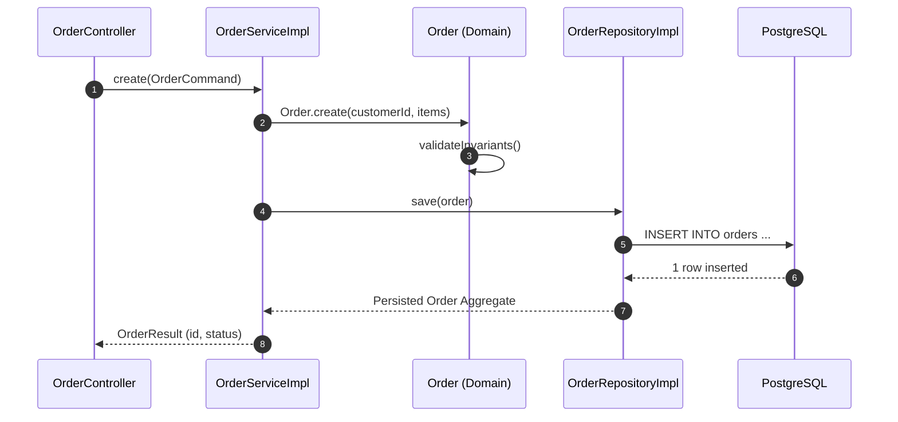

# LLD Method Invocation Sequence Specification

```mermaid
sequenceDiagram
    autonumber
    participant Ctrl as OrderController
    participant Svc as OrderServiceImpl
    participant Dom as Order (Domain)
    participant Repo as OrderRepositoryImpl
    participant DB as PostgreSQL

    Ctrl->>Svc: create(OrderCommand)
    Svc->>Dom: Order.create(customerId, items)
    Dom->>Dom: validateInvariants()
    Svc->>Repo: save(order)
    Repo->>DB: INSERT INTO orders ...
    DB-->>Repo: 1 row inserted
    Repo-->>Svc: Persisted Order Aggregate
    Svc-->>Ctrl: OrderResult (id, status)
```
