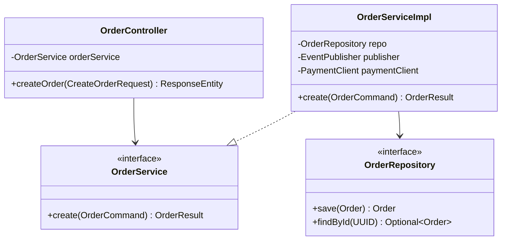

# LLD Service & Dependency Injection Specification

## 1. Service Wiring & Beans

## 2. Bean Lifecycles & Scopes
* All service implementations are stateless singletons managed by Spring or Guice.
* Scoped objects (UserContext) injected via RequestContextHolder / Go context.Context.
