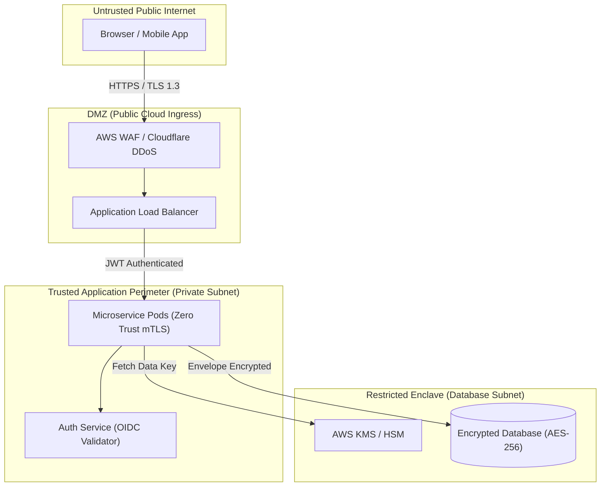

# Security Design Specification: [SYSTEM NAME]

---
**Metadata**:
```yaml
document_id: "SEC-[SYSTEM-ID]-001"
title: "Security Design Specification — [System Name]"
version: "1.0.0"
status: "Draft" # Draft | In Review | Approved | Implemented
security_architect: "[Security Architect Name <email>]"
lead_engineer: "[Lead Engineer Name]"
compliance_scope: "PCI-DSS Level 1 / SOC 2 Type II / GDPR"
data_classification: "Restricted - Confidential"
created_date: "YYYY-MM-DD"
```
---

## 1. Executive Summary & Security Objectives
* High-level overview of the security architecture and compliance posture.
* Confidentiality, Integrity, and Availability (CIA) goals.

## 2. Trust Boundaries & Data Flow
Reference Trust Boundary Diagrams from [[17-diagrams/05-security-diagrams/02-trust-boundaries.md](../../17-diagrams/security/trust-boundaries.md)].



## 3. STRIDE Threat Model & Countermeasures
| Threat Category | Potential Attack Vector | Architectural Countermeasure | Risk Level |
|---|---|---|---|
| **Spoofing** | Forged JWT access token | Cryptographic signature verification via OIDC JWKS | High $
ightarrow$ Low |
| **Tampering** | Man-in-the-middle packet tampering | Strict TLS 1.3 with mTLS inside the service mesh | High $
ightarrow$ Low |
| **Repudiation** | Operator denies executing funds transfer | Immutable, cryptographically signed audit trail in SIEM | Med $
ightarrow$ Low |
| **Information Disclosure** | Database dump exposes credit card numbers | Column-level AES-256-GCM envelope encryption via KMS | Critical $
ightarrow$ Low |
| **Denial of Service** | Volumetric HTTP flood | Cloudflare DDoS mitigation and API token bucket rate limits | High $
ightarrow$ Low |
| **Elevation of Privilege** | Bypassing tenant boundary | ABAC authorization enforcing tenant_id claim on every SQL query | Critical $
ightarrow$ Low |

## 4. Identity, Authentication & Authorization
* Identity Provider: Okta / Ping Identity integrating SAML 2.0 and OIDC.
* Token Exchange: Short-lived JWTs (15-minute expiration) with refresh token rotation.
* Authorization: Fine-grained RBAC with Open Policy Agent (OPA) policy enforcement.

## 5. Cryptography & Key Management
* In Transit: TLS 1.3 with ECDHE forward secrecy; TLS 1.0/1.1 strictly disabled.
* At Rest: AES-256-GCM envelope encryption using AWS KMS Customer Managed Keys (CMKs) with automated annual rotation.

## 6. Audit Logging & Security Operations
* Security events (Login, Auth failure, Permission change, Sensitive data access) emitted as structured JSON to AWS CloudWatch and ingested by Splunk SIEM.
* Alert triggers: 5 failed admin logins in 60 seconds triggers automatic IP block and SOC alert.

## 7. Compliance & Regulatory Alignment
* Complete mapping to PCI-DSS, SOC 2, HIPAA, and ISO 27001 requirements.
