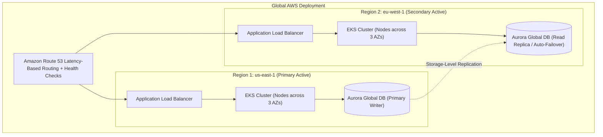

# Deployment Design Specification: [SYSTEM NAME]

---
**Metadata**:
```yaml
document_id: "DEP-[SYSTEM-ID]-001"
title: "Deployment Design Specification — [System Name]"
version: "1.0.0"
status: "Draft" # Draft | In Review | Approved | Implemented
platform_architect: "[Platform Architect Name <email>]"
lead_devops: "[Lead DevOps Engineer Name]"
target_cloud: "AWS / Multi-Region"
created_date: "YYYY-MM-DD"
```
---

## 1. Executive Summary & Infrastructure Goals
* Purpose of deployment architecture and target SLA/SLO baselines.
* Target hosting model (Public Cloud, Hybrid, On-Premises K8s).

## 2. Global Network Topology & VPCs
Reference Network & Deployment Diagrams from [[17-diagrams/06-deployment-diagrams/README.md](../../17-diagrams/deployment/README.md)].



## 3. Compute Infrastructure (Kubernetes / EKS)
* Node Groups: Graviton (ARM64) `m7g.xlarge` instances provisioned via Karpenter.
* Pod Resource Quotas: Requests (CPU 500m, Mem 1Gi); Limits (CPU 2000m, Mem 2Gi).

## 4. Ingress & Load Balancing
* AWS ALB with AWS WAF enabled. TLS 1.3 terminated at ALB using ACM certificates.
* Internal routing managed by Kong Ingress Controller with mTLS mesh.

## 5. Persistence & Clustering
* Aurora PostgreSQL Serverless v2 scaling between 4 and 64 ACUs.
* Read replicas distributed across 3 Availability Zones.

## 6. Observability & Telemetry Agents
* Prometheus Agent / OpenTelemetry Collector DaemonSet on every node.
* FluentBit shipping structured logs to Amazon CloudWatch and Splunk.

## 7. Deployment Strategy & Rollback Triggers
* ArgoCD GitOps using **Canary Deployments** via Argo Rollouts.
* Automated Rollback Trigger: If Prometheus records HTTP 5xx error rate > 1.0% or p99 latency > 500ms during canary analysis (10% traffic for 10 minutes), deployment halts and rolls back instantly.
