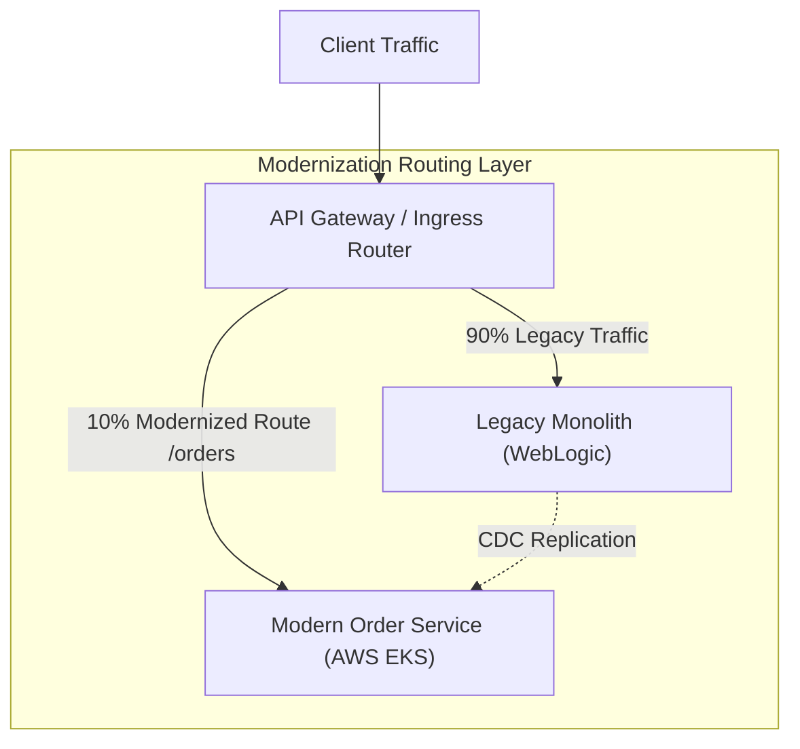

# Modernization Plan: [LEGACY SYSTEM NAME]

---
**Metadata**:
```yaml
modernization_id: "MOD-PLAN-[PROJECT-ID]"
title: "Enterprise Modernization Plan — [System Name]"
version: "1.0.0"
status: "Draft" # Draft | In Review | Approved | In Execution
lead_architect: "[Enterprise Architect Name <email>]"
target_completion: "2027-Q4"
created_date: "YYYY-MM-DD"
```
---

## 1. Executive Summary & Strategic Drivers
* Current legacy platform: 15-year-old COBOL / Java EE monolith running on mainframe / WebLogic.
* Primary drivers: Inability to ship features rapidly, severe shortage of legacy talent, high license fees ($3.5M/year).

## 2. Technical Debt & Health Assessment
| Capability / Module | Business Value (1-5) | Technical Health (1-5) | Selected 7R Strategy | Justification |
|---|---|---|---|---|
| **Core Account Balance** | 5 (Critical) | 2 (Fragile) | **Rearchitect** | Core business differentiator; decompose via Strangler Fig |
| **Batch Statements** | 2 (Low) | 4 (Stable) | **Retain** | Low maintenance; runs reliably once a month |
| **Tax Reporting** | 3 (Medium) | 1 (Obsolete) | **Replace** | Replace with standard commercial SaaS solution |

## 3. Strangler Fig Architecture & Migration Waves
Reference Strangler Fig diagram from [[17-diagrams/04-integration-diagrams/README.md](../../17-diagrams/integration/README.md)].



* **Wave 1 (Months 1–6)**: Deploy API Gateway routing facade and modern Identity/Auth.
* **Wave 2 (Months 7–12)**: Strangle Customer Profile & Notifications modules.
* **Wave 3 (Months 13–18)**: Strangle Core Order & Payment engines.
* **Wave 4 (Months 19–24)**: Decommission legacy database and shut down mainframe.
