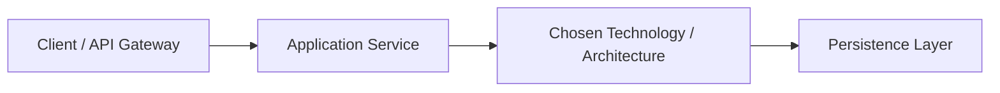

# ADR-XXXX: [Short Title of Architectural Decision]

> **Status**: [Proposed | Accepted | Superseded | Deprecated | Rejected]  
> **Date**: [YYYY-MM-DD]  
> **Deciders**: [List Architects, Lead Engineers, Stakeholders]  
> **Consulted**: [Security, SRE, Product, Domain SMEs]  
> **Informed**: [Engineering Squads, DevOps, Management]  
> **Supersedes**: [ADR-YYYY (Optional)]  
> **Superseded By**: [ADR-ZZZZ (Optional)]

---

## 1. Context and Problem Statement
*Describe the context and the problem that needs to be addressed. What business capability, performance bottleneck, security requirement, or technical debt triggered this decision? Include any relevant background context, user scale, or architectural constraints.*

---

## 2. Decision Drivers
*What are the primary factors influencing this decision?*
* [Driver 1, e.g., Must support p99 latency < 50ms at 10,000 requests/sec]
* [Driver 2, e.g., Must comply with GDPR data sovereignty in EU regions]
* [Driver 3, e.g., Existing engineering squad has strong C#/.NET experience]
* [Driver 4, e.g., Target monthly infrastructure budget ceiling is $5,000]

---

## 3. Considered Options
*List all candidate architectural approaches or technologies evaluated.*
* **Option 1**: [Name of Approach 1, e.g., In-Memory Cache (Redis Cluster)]
* **Option 2**: [Name of Approach 2, e.g., Distributed SQL (CockroachDB)]
* **Option 3**: [Name of Approach 3, e.g., Relational Database with Read Replicas (PostgreSQL)]

---

## 4. Decision Outcome
**Chosen Option**: **[Option X]**, because [concise justification summarizing the core winning factors].

### Decision Summary & Architectural Topology
*Provide a concise summary and, where applicable, a visual diagram of how the chosen option integrates into the system.*

---

## 5. Pros and Cons of Considered Options

### Option 1: [Name of Option 1]
* *Description*: [Brief description]
* **Good / Advantages**:
  * [Advantage 1]
  * [Advantage 2]
* **Bad / Drawbacks**:
  * [Drawback 1]
  * [Drawback 2]
* **Why Rejected / Deferred**: [Explicit reason why this option was not selected]

### Option 2: [Name of Option 2]
* *Description*: [Brief description]
* **Good / Advantages**:
  * [Advantage 1]
  * [Advantage 2]
* **Bad / Drawbacks**:
  * [Drawback 1]
  * [Drawback 2]
* **Why Rejected / Deferred**: [Explicit reason why this option was not selected]

### Option 3 (Chosen): [Name of Chosen Option]
* *Description*: [Brief description]
* **Good / Advantages**:
  * [Advantage 1]
  * [Advantage 2]
* **Bad / Drawbacks (Sacrifices Accepted)**:
  * [Sacrifice 1, e.g., Increases operational complexity by requiring ZooKeeper/KRaft management]
  * [Sacrifice 2, e.g., Requires custom serializer to maintain wire compatibility]

---

## 6. Consequences & Impact Analysis

### Positive Consequences
* [e.g., Eliminates primary database read lock contention]
* [e.g., Unlocks horizontal scaling for search queries]

### Negative Consequences & Accepted Risks
* [e.g., Introduces eventual consistency window of up to 500ms between primary and replicas]
* [e.g., Requires engineering teams to implement cache-aside invalidation patterns]

### Compliance, Security & Data Protection Impact
* [Detail impact on GDPR, PCI-DSS, encryption, auth, or audit trails]

### FinOps & Cost Impact
* [Detail projected infrastructure, licensing, and operational cost changes]

---

## 7. Validation & Follow-up Plan
*How will this decision be validated in staging/production, and what metrics confirm success?*
* [ ] Performance load test executed reaching 1.5x forecasted peak traffic.
* [ ] Chaos test verifying automatic failover completed.
* [ ] Telemetry dashboards and SLO alerts deployed to Datadog / Grafana.
* [ ] SRE operational runbook documented and reviewed.

---

## 8. References
* [Link to Architecture Evaluation Scorecard](../DECISION-MAKING-FRAMEWORK.md)
* [Link to System Solution Architecture Document](solution-architecture/)
* [Vendor Whitepaper / RFC / Technical Benchmark]
