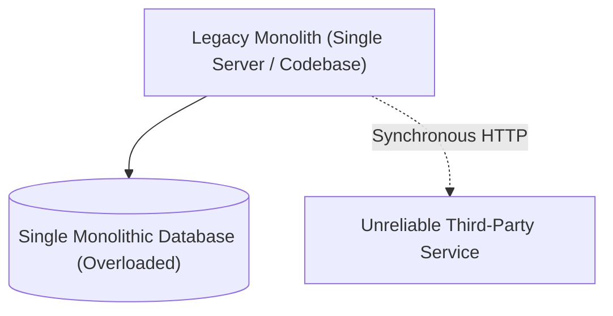
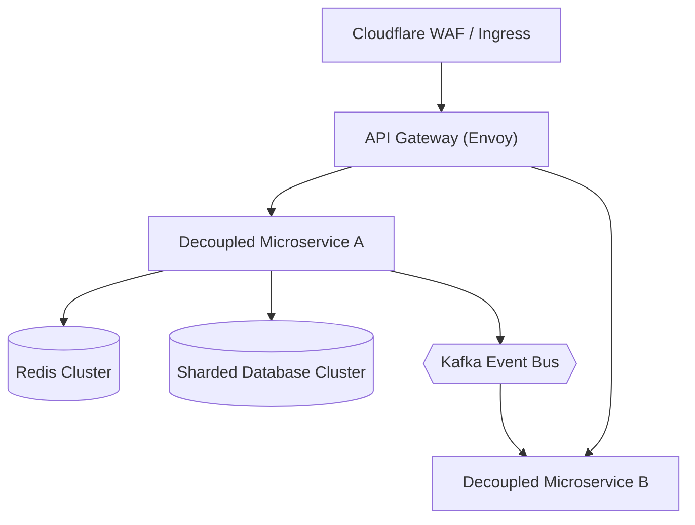

# Case Study & Post-Mortem: [Title of Transformation / Outage]

> **Organization / System**: [e.g., Global FinTech / High-Throughput Payment Engine]  
> **Author**: [Lead Architect / Principal Engineer]  
> **Category**: [Scalability Leap / Legacy Modernization / Major Outage Post-Mortem / Cloud Migration]  
> **Date of Incident / Milestone**: [YYYY-MM-DD]  
> **Document Status**: Complete

---

## 1. Executive Summary

*Provide a 1-2 paragraph executive overview summarizing the challenge, the transformation or incident, the core architectural inflection point, and the ultimate business/technical outcome.*

---

## 2. The Baseline: Initial Architecture & Technical Debt

*Describe the system state prior to the transformation or incident.*

### Key Deficiencies in the Baseline
* **Single Point of Failure (SPOF)**: Single monolithic database instance with no automated failover.
* **Cascading Timeouts**: Synchronous network calls blocking web server worker threads.
* **Deployment Bottleneck**: Bi-weekly manual deployments requiring full system downtime.

---

## 3. The Triggering Event / Transformation Catalyst

*What forced the architectural intervention? (e.g., Black Friday traffic spike collapsed the database, or an executive mandate required entering 10 new countries in 6 months).*

---

## 4. The Architectural Transformation

### Architectural Interventions Executed
1. **Strangler Fig Pattern**: Incrementally routed 10% of read traffic to a new decoupled microservice before migrating write workflows.
2. **Asynchronous Decoupling**: Replaced synchronous REST HTTP chaining with event-driven Kafka messaging and transactional outbox.
3. **Database Sharding**: Partitioned the monolithic database by tenant ID, reducing single-node IOPS contention by 80%.

---

## 5. What Failed During the Journey (Lessons from the Trenches)

*Document real-world complications, unexpected failure modes, and bugs encountered during migration:*
* **Incident 1**: [e.g., Cache stampede during initial cold cache rollout; mitigated by pre-warming cache and mutex locks].
* **Incident 2**: [e.g., Kafka consumer group lag accumulated due to improper partition key distribution].

---

## 6. Measurable Outcomes & Business Impact

| Metric | Before Transformation | After Transformation | Delta / Improvement |
| :--- | :--- | :--- | :--- |
| **Peak Throughput** | 1,200 RPS (System collapsed) | 25,000 RPS sustained | **+1,980% capacity** |
| **p99 API Latency** | 1,800ms | 42ms | **-97.6% latency** |
| **Deployment Frequency** | Once every 2 weeks | 15+ times daily | **Continuous Delivery** |
| **Unplanned Downtime** | 4.2 hours / month | 0 hours (99.99% SLA) | **High Availability** |
| **Annual Cloud Spend**| $1.2M (unoptimized VMs) | $620k (Graviton + Spot) | **-48% FinOps savings** |

---

## 7. Key Architectural Takeaways

1. **Takeaway 1**: [e.g., Never decompose a database without first verifying query patterns via APM].
2. **Takeaway 2**: [e.g., Always implement circuit breakers with synthetic fallbacks before exposing third-party APIs to customers].
3. **Takeaway 3**: [e.g., Modular monoliths should often precede microservices to validate domain boundaries].
