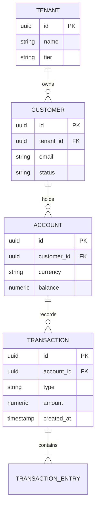

# Data Architecture & Storage Design: [System / Domain]

> **Domain**: [e.g., Ledger & Financial Records]  
> **Data Architect**: [Name / Title]  
> **Status**: [Draft | Review | Approved]  
> **Date**: [YYYY-MM-DD]  
> **Related SAD**: [Link to Solution Architecture Document](solution-architecture/)

---

## 1. Data Requirements & Workload Profiling

### 1.1 Read vs. Write Ratio & Query Patterns
* **Read / Write Ratio**: 95% Read / 5% Write (e.g., Heavy Catalog Browsing) vs. 50% Read / 50% Write (e.g., IoT Telemetry).
* **Peak Operations**: 20,000 read queries/sec, 1,000 write transactions/sec.
* **Working Set Size**: Total active records queried in a 24-hour window = 250 GB (Fits entirely into Redis/RAM cache).
* **Historical Growth**: 15 GB new data appended daily (~5.5 TB/year).

---

## 2. Storage Engine Selection Matrix

| Storage Category | Engine Selected | Consistency Model | Primary Use Case |
| :--- | :--- | :--- | :--- |
| **Relational OLTP** | PostgreSQL 16 (AWS Aurora) | ACID (Read Committed) | Financial Ledgers, Customer Profiles |
| **Distributed Cache** | Redis Cluster 7.x | BASE (Eventual) | Session state, token blacklists, catalog cache |
| **Event Log / Stream** | Apache Kafka | Ordered per-partition | Domain event stream, audit trail |
| **Analytical Lakehouse**| Apache Iceberg + S3 | ACID on Object Storage | BI, compliance audits, historical reporting |
| **Search Index** | OpenSearch 2.x | Eventual consistency | Full-text product search, faceted filtering |

---

## 3. Logical & Physical Data Models

### 3.1 Entity-Relationship Model (ERD)

---

## 4. Sharding, Partitioning & Indexing Strategy

* **Sharding Key**: `tenant_id` + `hash(customer_id)`. Distributes load uniformly across database shards while keeping all data for a single customer within the same physical node.
* **Table Partitioning**: Range partitioning on `TRANSACTION` by month (`PARTITION BY RANGE (created_at)`). Partitions older than 12 months are automatically detached and migrated to Iceberg/S3.
* **Indexing Hygiene**:
  * Mandatory composite index on `(tenant_id, status, created_at DESC)` for common dashboard queries.
  * Partial index on active rows only: `CREATE INDEX idx_active_orders ON orders(id) WHERE status = 'PENDING'`.

---

## 5. Data Replication, Backup & Retention Policies

* **Replication**: Multi-AZ synchronous replication for zero data loss (RPO = 0 inside region); cross-region asynchronous replication (RPO `< 30s`).
* **Backup Schedule**:
  * Continuous point-in-time recovery (PITR) with WAL archiving up to 35 days.
  * Daily encrypted full snapshots retained for 90 days.
  * Monthly cold archives exported to immutable AWS S3 Glacier with Object Lock (WORM compliance) for 7 years.

---

## 6. Privacy, PII & Regulatory Compliance

* **PII Classification**: Customer name, phone, email, and IP address tagged as `Confidential-PII`.
* **Field-Level Encryption**: Application-layer AES-256-GCM encryption before persisting SSN or payment account numbers.
* **Right to Be Forgotten (GDPR Article 17)**: Cryptographic erasure pattern—encrypt customer PII with a unique customer-specific key in KMS; upon deletion request, destroy the customer key, rendering all historical backups instantly unreadable.
