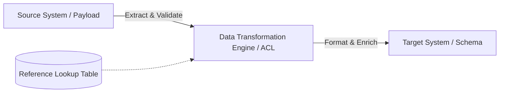

# Enterprise Data Mapping Specification Template

> **Document Reference**: `MAP-[DOMAIN]-[SOURCE]-[TARGET]-v[VERSION]`  
> **Status**: [Draft | In Review | Approved | Deprecated]  
> **Source System**: [e.g., Core Banking System (FIS)]  
> **Target System**: [e.g., Enterprise Payment Hub]  
> **Business Domain**: [e.g., Payments / Settlement / Customer]  
> **Data Architect / Owner**: [Name & Role]  
> **Technical Steward**: [Name & Role]  
> **Effective Date**: [YYYY-MM-DD]  
> **Version**: [1.0.0]

---

## 1. Executive Purpose & Scope
*Define the business capability, integration trigger, and systems involved. Detail whether this mapping governs real-time API transactions, asynchronous event payloads, batch file interfaces, or database migration pipelines.*

---

## 2. Architectural Context & Data Flow

---

## 3. Entity-Level Relationship
| Source Entity | Target Entity | Cardinality | Dependency / Pre-requisite |
|---|---|---|---|
| `SRC_PAYMENT_TXN` | `PaymentOrder` | 1 : 1 | Customer Account must exist |
| `SRC_TXN_FEES` | `PaymentFeeSchedule` | 1 : N | Fee configuration active |

---

## 4. Field-Level Source-to-Target Specification Matrix

| Source Field | Source Type | Target Field | Target Type | Mandatory? | Transformation Rule | Validation Rule | Lookup / Default | Error Handling | Data Quality Rule | Test Case Ref |
|---|---|---|---|---|---|---|---|---|---|---|
| `tx_id` | `VARCHAR(36)` | `id` | `UUID` | Mandatory | Direct pass-through | Must be valid UUID v4 | None | Reject (400) | Uniqueness | `TC-PAY-001` |
| `amt_cents` | `BIGINT` | `amount.value` | `DECIMAL(18,4)`| Mandatory | `amt_cents / 100.0` | Value > 0 | None | Reject (422) | Precision check | `TC-PAY-002` |
| `curr_cd` | `CHAR(3)` | `amount.currency`| `ISO_4217` | Mandatory | Trim & uppercase | Valid ISO-4217 code | Default `USD` | Fallback default | Currency check | `TC-PAY-003` |
| `st_cd` | `INT` | `status` | `ENUM` | Mandatory | Code translation table | Known enum value | Map via `LK_STATUS`| Dead-letter queue| Domain check | `TC-PAY-004` |
| `cust_ref` | `VARCHAR(50)` | `reference.external`| `STRING(64)`| Optional | Strip special characters | Max length 64 | Default `null` | Truncate & log | Sanitization | `TC-PAY-005` |
| `created_ts` | `BIGINT (epoch)` | `createdAt` | `ISO_8601 UTC` | Mandatory | Convert epoch ms to UTC | Cannot be in future | Current UTC time | Reject (422) | Temporal validity | `TC-PAY-006` |

---

## 5. Code Translation & Lookup Tables
### Lookup Table: Payment Status (`LK_STATUS`)
| Source Code (`st_cd`) | Source Description | Target Enum (`status`) | Action / Business Notes |
|---|---|---|---|
| `0` | New / Pending | `PENDING` | Default initial state |
| `1` | Approved / Captured | `SETTLED` | Funds confirmed |
| `2` | Declined | `REJECTED` | Trigger customer notification |
| `9` | Canceled | `CANCELLED` | Void authorization |
| `*` | Any unmapped code | `EXCEPTION` | Route to Exception Queue for triage |

---

## 6. Business Transformation Rules & Edge Cases
* **Null & Missing Value Handling**: Detail explicit behavior for missing optional vs missing mandatory fields.
* **Rounding & Currency Precisions**: Define half-even (banker's rounding) rules for fractional decimals.
* **Date & Timezone Conversions**: All timestamps must be converted to UTC with millisecond or microsecond precision.
* **Character Encoding & Normalization**: UTF-8 normalization (NFC) and stripping of non-printable control characters.

---

## 7. Data Quality & Reconciliation Controls
* **Integrity Invariant**: Sum of target batch lines must equal source control header `batch_total_amount`.
* **Idempotency Rule**: Duplicate incoming payloads with identical `(source_system, tx_id)` must produce idempotent acknowledgements without duplicate processing.
* **Audit Trail**: Target records must store source metadata (`_source_system`, `_source_id`, `_mapped_at`).

---

## 8. Approval & Sign-Off Matrix
| Role | Name | Title | Decision | Date |
|---|---|---|---|---|
| Source System Architect | | | [ ] Approved [ ] Rejected | |
| Target System Architect | | | [ ] Approved [ ] Rejected | |
| Enterprise Data Steward | | | [ ] Approved [ ] Rejected | |
