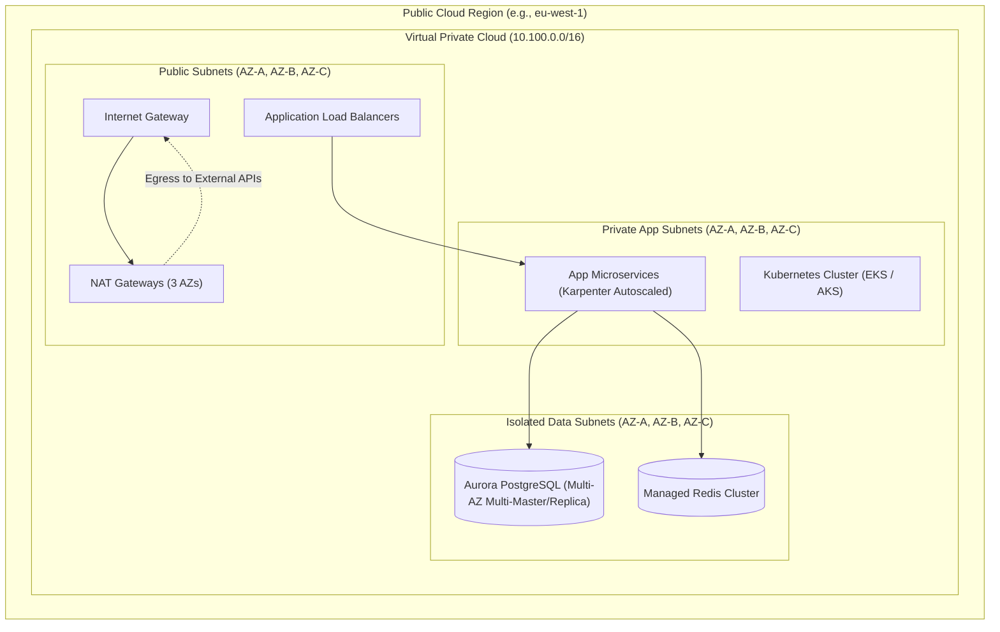

# Deployment & Infrastructure Design: [System / Platform]

> **Platform**: [System Name]  
> **Cloud Provider**: [AWS / Azure / GCP / Hybrid]  
> **Author**: [Principal Cloud Architect / Staff SRE]  
> **Status**: [Draft | In-Review | Approved]  
> **Date**: [YYYY-MM-DD]  
> **Related SAD**: [Link to Parent Solution Architecture Document](solution-architecture/)

---

## 1. Cloud Network Topology & VPC Architecture

*Describe the multi-zone, multi-region Virtual Private Cloud (VPC) topology, subnets, DMZ, and routing tables.*

---

## 2. Compute & Kubernetes Cluster Sizing

### 2.1 Pod & Resource Specifications

| Service Name | Base Pods | Max Pods | CPU Request / Limit | Memory Request / Limit | Autoscaling Trigger |
| :--- | :---: | :---: | :---: | :---: | :--- |
| **API Gateway Pods** | 6 | 30 | 500m / 1000m | 512Mi / 1024Mi | CPU > 70% or Latency > 80ms |
| **Core Payment Service**| 6 | 40 | 1000m / 2000m | 1024Mi / 2048Mi | Request Rate > 200 RPS/pod |
| **Worker Queue Consumers**| 4 | 24 | 1000m / 2000m | 2048Mi / 4096Mi | Kafka Consumer Group Lag > 1000 |

### 2.2 Node Pools & Instance Types
* **General Compute**: AWS `m7g.xlarge` (AWS Graviton3, ARM64) for cost-efficiency.
* **Auto-Provisioning**: Karpenter dynamically provisioning nodes based on pod resource requirements; zero pre-warmed idle VM waste.

---

## 3. CI/CD & Deployment Pipeline Strategy

```mermaid
flowchart LR
    Dev["Developer Git Push"] --> CI["GitHub Actions CI"]
    CI --> Tests["Unit, Lint, SAST & SCA Scans"]
    Tests --> Build["Build Distroless Container & Sign (Cosign)"]
    Build --> Registry["OCI Container Registry (ECR/ACR)"]
    Registry --> GitOps["GitOps Repo Update"]
    GitOps --> ArgoCD["ArgoCD Deployment Engine"]
    ArgoCD --> Canary["Canary Rollout (Argo Rollouts)"]
    Canary --> Prod["100% Production Traffic"]
```

* **Deployment Strategy**: **Canary Rollout via Argo Rollouts**:
  * 10% traffic routed to canary version for 15 minutes.
  * Automated metric analysis (Prometheus queries checking HTTP 5xx rate `< 0.1%` and p99 latency `< 120ms`).
  * If analysis succeeds, advance to 25%, 50%, then 100%.
  * If analysis fails, automatic instant rollback in `< 10 seconds` with zero downtime.

---

## 4. Environment Matrix & Configuration

| Environment | Purpose | Hosting Model | Data Policy |
| :--- | :--- | :--- | :--- |
| **Dev** | Feature branch testing | Shared dev Kubernetes cluster | Synthetically generated mock data |
| **Stage / QA** | Full integration, contract & performance tests| Exact mirror of production topology | Masked, scrubbed production data subset |
| **Production** | Live customer workloads | Dedicated isolated production AWS accounts| Live customer data, strictly isolated |

---

## 5. Disaster Recovery & Failover Mechanics

* **Recovery Tier**: Tier 1 Critical (RTO `< 15m`, RPO `< 1m`).
* **Multi-Region Strategy**: Warm Standby (Pilot Light) deployed in secondary region (`eu-central-1`).
* **Failover Trigger**: Route 53 DNS Health Checks detect primary region failure after 3 consecutive failed probes (30 seconds). DNS automatically points traffic to secondary region load balancer.
