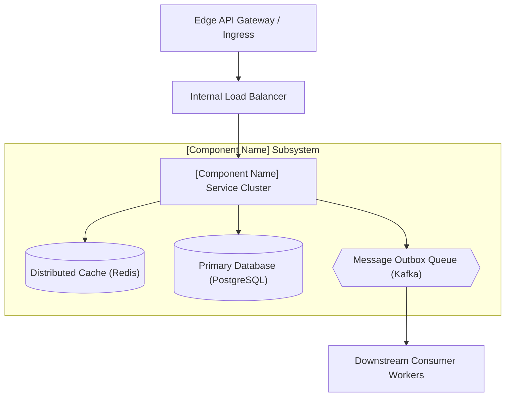
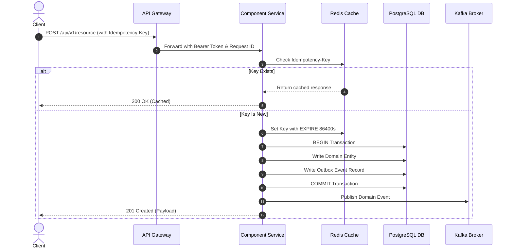

# High-Level Design (HLD): [Component / Subsystem Name]

> **System / Domain**: [e.g., Core Payments / Checkout Subsystem]  
> **Author**: [Lead Architect / Staff Engineer]  
> **Status**: [Draft | In-Review | Approved]  
> **Target Version**: [v1.0]  
> **Date**: [YYYY-MM-DD]  
> **Related SAD**: [Link to Parent Solution Architecture Document](../solution-architecture/)

---

## 1. Introduction & Context

### 1.1 Purpose
*Provide a concise description of what this component accomplishes within the larger enterprise platform.*

### 1.2 Scope
* **In-Scope**: [Key capabilities delivered by this component]
* **Out-of-Scope**: [Boundaries handled by other services]

### 1.3 Architecture Drivers & NFRs
* **Latency SLA**: p99 `< 50ms`
* **Throughput**: `2,500 operations/second`
* **Availability**: `99.95%`

---

## 2. High-Level Architecture Topology

---

## 3. Component Breakdown & Responsibilities

| Sub-Component | Responsibility | Technology Stack | Scaling Model |
| :--- | :--- | :--- | :--- |
| **API Controller Layer** | Request validation, auth termination, rate limiting | ASP.NET Core 8 / Spring Boot 3 | Horizontal (K8s HPA: CPU/Memory) |
| **Domain Logic Core** | Business rule validation, invariant enforcement | Plain language domain model | Stateless in-memory compute |
| **Persistence Gateway** | Query execution, connection pooling, cache lookup | EF Core / Hibernate + HikariCP | Connection pool sizing (max 50/pod) |
| **Event Dispatcher** | Transactional outbox event publishing | Kafka Producer / Debezium CDC | At-least-once with idempotent consumer |

---

## 4. Communication & Integration Patterns

### 4.1 Ingress Communication (Inbound)
* **Protocol**: RESTful JSON over HTTPS (OpenAPI 3.1) / gRPC over HTTP/2.
* **Authentication**: JWT Bearer token validated against enterprise OIDC JWKS.
* **Rate Limiting**: 500 requests/minute per API client token via Token Bucket algorithm.

### 4.2 Egress Communication (Outbound)
* **Downstream RPC**: Circuit-breaker protected HTTP/gRPC calls with 1.5s timeout.
* **Event Publishing**: Outbox pattern writing events transactionally to database before emitting to Kafka topic.

---

## 5. Data Flow & Transaction Lifecycle

---

## 6. Security & Compliance Architecture

* **Authentication & Authorization**: Role-based access control (RBAC) enforced at endpoint handlers via OAuth2 scopes (`scope:read`, `scope:write`).
* **Data-at-Rest Protection**: Database volume encrypted with AWS KMS / Azure Key Vault (AES-256).
* **Sensitive Fields**: PII fields (SSN, credit card, phone) encrypted at application layer using envelope encryption before persisting.

---

## 7. Reliability & Resiliency Engineering

* **Timeouts**: Strict 1,500ms timeout on all outbound network calls.
* **Circuit Breakers**: Polly / Resilience4j opening after 5 consecutive failures, with 30-second half-open cooldown.
* **Retry Strategy**: 3 retries with exponential backoff and jitter (`100ms`, `400ms`, `1600ms`).
* **Fallback Strategy**: Return cached stale data or graceful degradation response when non-critical downstream services fail.

---

## 8. Observability & Telemetry

* **Metrics**: Prometheus RED metrics (`http_requests_total`, `http_request_duration_seconds_bucket`, `http_requests_failed_total`).
* **Distributed Traces**: W3C `traceparent` propagation across all HTTP and Kafka boundaries.
* **Structured Logs**: Mandatory JSON schema including `trace_id`, `span_id`, `tenant_id`, `user_id`.

---

## 9. Review & Approvals

* [ ] **Solution Architect Approval**: [Name / Date]
* [ ] **Security Lead Approval**: [Name / Date]
* [ ] **Engineering Squad Lead Approval**: [Name / Date]
