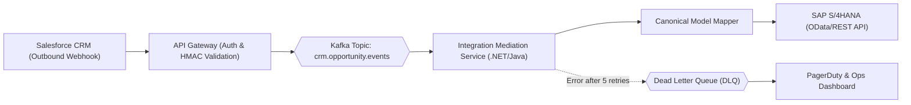
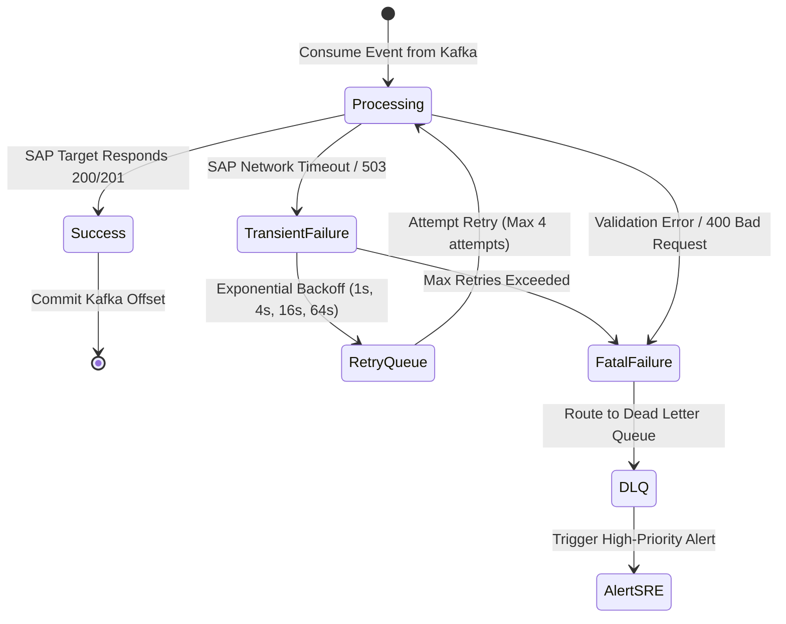

# Enterprise Integration Specification: [Integration Name]

> **Integration ID**: [INT-XXXX]  
> **Source System**: [System A, e.g., Salesforce CRM]  
> **Target System**: [System B, e.g., SAP S/4HANA ERP]  
> **Pattern**: [Event-Driven / Synchronous REST / Batch ETL]  
> **Integration Architect**: [Name / Title]  
> **Status**: [Draft | In-Review | Approved]  
> **Date**: [YYYY-MM-DD]

---

## 1. Integration Scope & Business Objective

*Detail the business capability supported by this integration (e.g., Real-time synchronization of closed-won opportunities into ERP billing orders).*

---

## 2. Architectural Integration Topology



---

## 3. Communication Pattern & Protocols

* **Invocation Model**: Asynchronous Event-Driven Pub/Sub with guaranteed at-least-once delivery.
* **Payload Protocol**: CloudEvents v1.0 specification serialized in JSON or Apache Avro.
* **Throughput Profile**: Normal: 50 events/sec; Peak: 400 events/sec (End-of-Quarter batch close).
* **Guaranteed SLA**: End-to-end sync completed within `< 5 seconds` from event generation.

---

## 4. Message Contract & Schema Mapping

### 4.1 CloudEvents Envelope Contract
```json
{
  "specversion": "1.0",
  "type": "com.enterprise.crm.opportunity.won",
  "source": "https://crm.enterprise.domain/opportunities",
  "id": "A234-1234-1234",
  "time": "2026-09-05T08:45:00Z",
  "datacontenttype": "application/json",
  "dataschema": "https://schemas.enterprise.domain/events/opportunity-won-v1.json",
  "data": {
    "opportunityId": "opp_991823",
    "accountId": "acc_441029",
    "totalAmount": 125000.00,
    "currency": "USD",
    "contractStartDate": "2026-10-01"
  }
}
```

### 4.2 Data Transformation & Mapping Matrix

| Source Field (Salesforce) | Target Field (SAP ERP) | Transformation Rule | Default Value |
| :--- | :--- | :--- | :--- |
| `opportunityId` | `VBLEN_REF` | Prefix with `CRM-` | None (Mandatory) |
| `accountId` | `KUNNR` | Cross-reference via Master Data Customer Mapping Cache | Reject if unmapped |
| `totalAmount` | `NETWR` | Decimal round to 2 places | 0.00 |
| `currency` | `WAERK` | ISO 4217 verification | `USD` |

---

## 5. Idempotency & Duplicate Handling

* **Idempotency Token**: Computed hash: `SHA256(source + id + time)`.
* **Deduplication Mechanism**: Consumer service checks Redis distributed set. If token exists within 7-day retention window, message is acknowledged as processed and skipped.

---

## 6. Failure Modes, Retries & Dead Letter Queue (DLQ)



---

## 7. Security, Auditing & Compliance

* **Webhook Ingress Verification**: HMAC-SHA256 signature verified via shared secret before accepting webhook.
* **Target Authorization**: OAuth 2.0 Client Credentials flow with mTLS certificates connecting to SAP API.
* **Audit Trail**: Full message payload and processing status logged to immutable audit storage with a 7-year retention policy for financial compliance.
