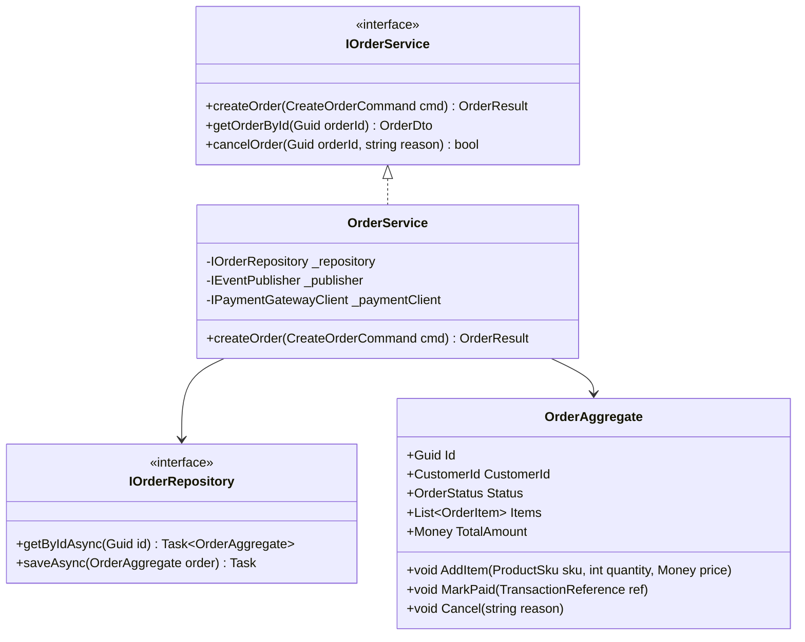
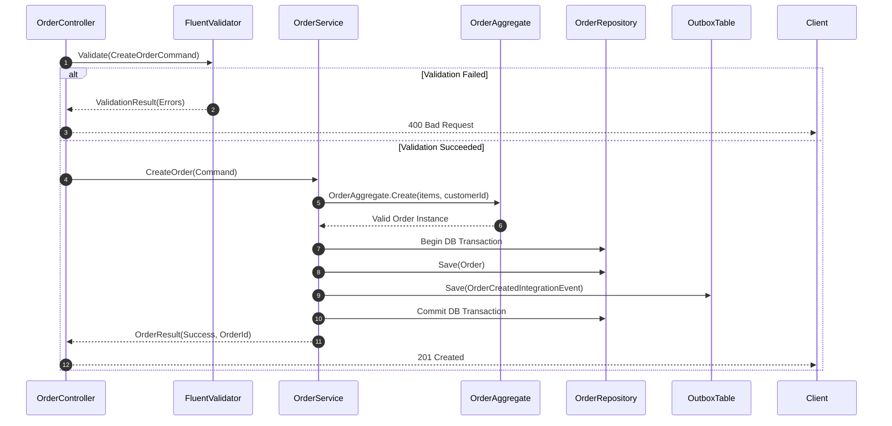

# Low-Level Design (LLD): [Service / Module Name]

> **Component / Service**: [Service Name]  
> **Parent HLD**: [Link to High-Level Design](../technical-design/HLD-xxx.md)  
> **Author**: [Senior Software Engineer / Tech Lead]  
> **Status**: [Draft | In-Review | Approved]  
> **Date**: [YYYY-MM-DD]  
> **Repository**: [Link to source code repository]

---

## 1. Module Overview & Responsibilities
*Provide precise details on the class, package, and module boundaries. Document the specific micro-service, daemon, or library internal structure.*

---

## 2. Class & Interface Hierarchy (UML Class Model)



---

## 3. Detailed Data Models & Database Schemas

### 3.1 Relational Schema (PostgreSQL DDL)

```sql
CREATE TABLE orders (
    order_id UUID PRIMARY KEY DEFAULT gen_random_uuid(),
    tenant_id VARCHAR(64) NOT NULL,
    customer_id UUID NOT NULL,
    status VARCHAR(32) NOT NULL DEFAULT 'PENDING',
    total_amount NUMERIC(12, 2) NOT NULL,
    currency VARCHAR(3) NOT NULL DEFAULT 'EUR',
    created_at TIMESTAMPTZ NOT NULL DEFAULT NOW(),
    updated_at TIMESTAMPTZ NOT NULL DEFAULT NOW(),
    version INT NOT NULL DEFAULT 1
);

CREATE INDEX idx_orders_tenant_cust ON orders(tenant_id, customer_id);
CREATE INDEX idx_orders_status ON orders(status) WHERE status = 'PENDING';

CREATE TABLE order_items (
    item_id UUID PRIMARY KEY DEFAULT gen_random_uuid(),
    order_id UUID NOT NULL REFERENCES orders(order_id) ON DELETE CASCADE,
    product_sku VARCHAR(64) NOT NULL,
    quantity INT NOT NULL CHECK (quantity > 0),
    unit_price NUMERIC(12, 2) NOT NULL
);
```

### 3.2 Indexing & Concurrency Control
* **Optimistic Locking**: Handled via the `version` column. Updates verify `WHERE order_id = :id AND version = :current_version`.
* **Partitioning**: Table `orders` range-partitioned quarterly by `created_at` once row count exceeds 10,000,000.

---

## 4. Method Signatures & Algorithmic Workflows

### 4.1 Order Placement Workflow


---

## 5. Error Handling, Exception Hierarchy & Status Codes

| Exception Class | Root Cause | HTTP Status | Retryable? | Metric Emitted |
| :--- | :--- | :---: | :---: | :--- |
| `ValidationException` | Malformed request or domain invariant broken | 400 | No | `errors_validation_total` |
| `EntityNotFoundException` | Target Order ID not in database | 404 | No | `errors_not_found_total` |
| `ConcurrencyConflictException`| Optimistic lock version mismatch | 409 | Yes (Auto-retry 3x) | `errors_concurrency_total` |
| `PaymentGatewayTimeoutException`| Downstream payment rail unresponsive | 504 | Yes (via DLQ) | `errors_gateway_timeout_total` |

---

## 6. Unit & Integration Testing Strategy

* **Unit Tests**: Mock external dependencies (`IOrderRepository`, `IEventPublisher`). Target code coverage: **85%+** on domain logic.
* **Integration Tests**: Use Testcontainers (PostgreSQL & Kafka container instances) to validate actual SQL queries, optimistic locking, and transaction rollbacks.
* **Contract Tests**: Pact tests verifying API contracts with upstream frontend clients.
