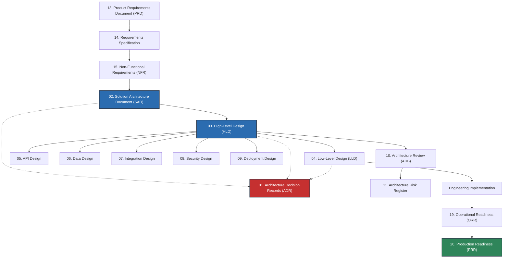

# Enterprise Architecture Deliverables & Templates Library

Welcome to the **Enterprise Architecture Deliverables & Templates Library**. This directory is the production artifact toolkit for Solution Architects, Technical Architects, Enterprise Architects, Engineering Leads, Security Architects, Data Architects, and Platform Architects across the enterprise software delivery lifecycle.

---

## 1. Mission & Purpose

> **An architect should be able to start a new enterprise project, select the appropriate deliverable template from this directory, copy it into a project or documentation repository, and immediately begin producing a professional, audit-ready architecture artifact.**

This library is neither abstract documentation theory nor an academic taxonomy. It provides production-tested frameworks, copyable Markdown templates, governance checklists, and domain-specific examples tailored to enterprise environments (such as Fortune 500, global fintech, regulated healthcare, and high-scale SaaS).

---

## 2. Target Audience & RACI Roles

| Role | Primary Deliverables Produced | Primary Deliverables Reviewed |
|---|---|---|
| **Solution Architect (SA)** | SAD, HLD, Migration Plan, Modernization Plan | PRD, LLD, API Design, Deployment Design |
| **Technical / Software Architect (TA)** | HLD, LLD, API Design, Data Design | Requirements, NFR, Security Design, PRR |
| **Enterprise Architect (EA)** | Reference Architecture, Architecture Review, ADR | SAD, Modernization Plan, Tech Debt Register |
| **Security Architect (SecArch)** | Security Design, Threat Models, Cryptography Design | SAD, HLD, API Design, Deployment Design |
| **Data Architect (DataArch)** | Data Design, Logical/Physical Schema, Lineage | SAD, Integration Design, API Design |
| **Platform / Cloud Architect** | Deployment Design, Disaster Recovery, Infrastructure | HLD, LLD, Operational Readiness, PRR |
| **Engineering Lead / Staff Engineer** | LLD, Service Specs, Runbooks, ADR | SAD, HLD, API Contracts |

---

## 3. Core & Supporting Deliverable Hierarchy

Enterprise architecture deliverables correspond directly to lifecycle phases and decision depth:

---

## 4. Deliverable Directory Index

### 12 Core Architecture Deliverables

1. [01-adr/](01-adr/README.md) — Architecture Decision Records (governance, lifecycle, templates, and 7 real-world decision cases).
   - *Active Repo Ledger*: [adr/](adr/README.md) contains 112+ live project ADRs.
2. [02-sad/](02-sad/README.md) — Solution Architecture Document (end-to-end multi-view system architecture).
3. [03-hld/](03-hld/README.md) — High-Level Design (subsystem architecture, component topology, integration boundaries).
4. [04-lld/](04-lld/README.md) — Low-Level Design (module structure, classes, sequence flows, transactional boundaries).
5. [05-api-design/](05-api-design/README.md) — API Design (REST, GraphQL, gRPC, Webhooks, Event schemas, RFC 7807 error models).
6. [06-data-design/](06-data-design/README.md) — Data Design (relational/NoSQL schemas, indexing, sharding, caching, OpenLineage).
7. [07-integration-design/](07-integration-design/README.md) — Integration Design (messaging, ETL, RPC, idempotency, failure compensation).
8. [08-security-design/](08-security-design/README.md) — Security Design (STRIDE threat models, trust boundaries, OAuth2/OIDC, KMS).
9. [09-deployment-design/](09-deployment-design/README.md) — Deployment Design (cloud topology, Kubernetes, serverless, networking, IAC).
10. [10-architecture-review/](10-architecture-review/README.md) — Architecture Review (ARB charter, review packets, gate criteria).
11. [11-risk-register/](11-risk-register/README.md) — Architecture Risk Register (scoring rubrics, mitigations, residual exposure).
12. [12-reference-architecture/](12-reference-architecture/README.md) — Reference Architecture (reusable organizational baselines and guardrails).

### 8 Supporting Architecture Deliverables

13. [13-prd/](13-prd/README.md) — Product Requirements Document (business drivers, user stories, architecture hand-off).
14. [14-requirements/](14-requirements/README.md) — Requirements Specification & Traceability Matrix (functional & structural).
15. [15-nfr/](15-nfr/README.md) — Non-Functional Requirements (measurable SLAs, SLOs, SLIs across 12 dimensions).
16. [16-migration-plan/](16-migration-plan/README.md) — Migration Plan (cutover runbooks, dual-write CDC, rollback strategies).
17. [17-modernization-plan/](17-modernization-plan/README.md) — Modernization Plan (legacy assessment, 7R decision tree, Strangler Fig).
18. [18-disaster-recovery/](18-disaster-recovery/README.md) — Disaster Recovery & BCP (RTO/RPO analysis, failover automation, game days).
19. [19-operational-readiness/](19-operational-readiness/README.md) — Operational Readiness Review (telemetry, runbooks, on-call paging).
20. [20-production-readiness/](20-production-readiness/README.md) — Production Readiness Review (formal Go/No-Go decision matrix).

---

## 5. Library Toolkit & Quick Access

* **[Deliverable Selection Guide](deliverable-selection-guide.md)**: Situational guide answering *"Which architecture deliverable should I write?"*.
* **[Documentation Lifecycle](documentation-lifecycle.md)**: Governance states from `Draft` to `Approved`, `Implemented`, and `Archived`.
* **[Documentation Standard](documentation-standard.md)**: Standard document metadata schema, single source-of-truth principles, and 18 anti-patterns.
* **[Master Architecture Documentation Checklist](architecture-documentation-checklist.md)**: Universal 30-point audit checklist.
* **[Master Templates Library](templates/)**: 20 Standalone, copy-ready Markdown templates for instant project setup.
* **[Checklist Library](checklists/)**: 14 Practical, checkbox-driven audit checklists for peer and governance reviews.
* **[Integrated Domain Examples](examples/)**: 7 Realistic, end-to-end architectures (e-commerce, banking, healthcare, insurance, SaaS, government, AI-platform).

---

## 6. Integration with Repository Visual Assets

`16-architecture-deliverables/` owns the **formal technical documentation structure**.
`17-diagrams/` owns the **visual modeling artifacts**.

Deliverables reference diagrams as follows:

| Deliverable | Visual Diagram Types in [17-diagrams/](../17-diagrams/README.md) |
|---|---|
| **SAD** | [C4 Context](../17-diagrams/c4/context.md), [C4 Container](../17-diagrams/c4/container.md), [Cloud Architecture](../17-diagrams/cloud/README.md) |
| **HLD** | [C4 Component](../17-diagrams/c4/component.md), [System Sequence](../17-diagrams/sequence/README.md), [Integration Flow](../17-diagrams/integration/README.md) |
| **LLD** | [UML Class & Component](../17-diagrams/c4/code.md), [Activity / State Machine](../17-diagrams/sequence/asynchronous.md) |
| **API Design** | [API Contract Flow](../17-diagrams/integration/README.md), [Sequence Timing](../17-diagrams/sequence/README.md) |
| **Data Design** | [Entity-Relationship (ERD)](../17-diagrams/data/README.md), [Data Flow Diagrams (DFD)](../17-diagrams/data-flow/README.md) |
| **Security Design** | [STRIDE Threat Model](../17-diagrams/security/threat-model.md), [Trust Boundaries](../17-diagrams/security/trust-boundaries.md) |
| **Deployment Design** | [Kubernetes Topology](../17-diagrams/deployment/kubernetes.md), [Multi-Region Cloud](../17-diagrams/deployment/multi-region.md) |

---

## 7. Related Repository Sections

- [01-architecture/](../01-architecture/README.md) — Architecture fundamentals, styles, and patterns.
- [02-system-design/](../02-system-design/README.md) — Distributed system design, scalability, and consensus.
- [06-data/](../06-data/README.md) — Database architectures, streaming, and lakehouses.
- [07-integration/](../07-integration/README.md) — Integration patterns, event brokers, and API gateways.
- [08-cloud/](../08-cloud/README.md) — Multi-cloud governance, landing zones, and FinOps.
- [09-devops/](../09-devops/README.md) — CI/CD, GitOps, IaC, and deployment engineering.
- [10-security/](../10-security/README.md) — Zero Trust, cryptography, IAM, and DevSecOps.
- [11-observability/](../11-observability/README.md) — Telemetry, SLIs/SLOs, alerting, and distributed tracing.
- [12-ai/](../12-ai/README.md) — Generative AI, LLMOps, vector search, and RAG architectures.
- [15-modernization/](../15-modernization/README.md) — Legacy migration, Strangler Fig, and monolith decomposition.
- [17-diagrams/](../17-diagrams/README.md) — Canonical enterprise architecture diagram catalog.
- [18-reference-architectures/](../18-reference-architectures/README.md) — Industry reference architectures.
- [19-case-studies/](../19-case-studies/README.md) — Real-world production engineering teardowns.
- [23-enterprise-architecture/](../23-enterprise-architecture/README.md) — Enterprise frameworks (TOGAF, Zachman, BIAN).
- [24-architect-mastery/](../24-architect-mastery/README.md) — Architecture leadership, trade-offs, and communication.
