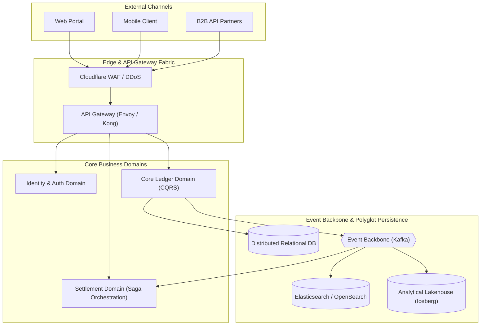

# Reference Architecture: [Industry / Domain Pattern Name]

> **Domain**: [e.g., Global FinTech Core Banking & Payments]  
> **Architecture Pattern**: [Event-Driven Microservices / Modular Monolith / CQRS]  
> **Author**: [Enterprise Architecture Practice]  
> **Version**: [1.0.0]  
> **Target Maturity**: Enterprise Production Standard

---

## 1. Domain Overview & Industry Context

*Describe the industry context, regulatory requirements, core business capabilities, and common anti-patterns found in this domain.*

### 1.1 Core Business Capabilities
* Capability 1: [e.g., Real-time transaction ledgering]
* Capability 2: [e.g., Multi-currency clearing and settlement]
* Capability 3: [e.g., Regulatory compliance reporting (AMLD5, FATCA)]

---

## 2. Prescriptive Architecture Blueprint (C4 Model)

---

## 3. Recommended Component Technology Stack

| Layer | Recommended Technology | Justification & Architectural Fit |
| :--- | :--- | :--- |
| **API Gateway** | Envoy / Kong Gateway | High-throughput C++ core, dynamic Lua/Wasm plugins, native OTel. |
| **Core Services** | .NET 8 / Java 21 LTS | High memory efficiency, mature enterprise ecosystems, virtual threads. |
| **Event Streaming** | Apache Kafka | Immutable append-only log, partitioning for scale, replayability. |
| **Transactional DB**| PostgreSQL / CockroachDB | Strong ACID guarantees, serializable isolation for ledgers. |
| **Cache & State** | Redis Cluster | Sub-millisecond latency for rate limiting and session tokens. |
| **Observability** | OpenTelemetry + Prometheus + Grafana | Vendor-neutral telemetry with distributed trace correlation. |

---

## 4. Key Architectural Patterns Applied

### 4.1 Pattern 1: Command Query Responsibility Segregation (CQRS)
* **Rationale**: High-volume write transactions (ledger entries) separated from complex read models (account statements, search filters).
* **Implementation**: Primary write database emits Change Data Capture (CDC) events to Kafka; read-model projectors update materialized views in Redis and Elasticsearch.

### 4.2 Pattern 2: Saga Pattern with Orchestration
* **Rationale**: Long-running distributed transactions across multiple microservices without locking shared databases.
* **Implementation**: A dedicated Settlement Orchestrator coordinates payment reservation, fraud evaluation, and ledger debit via asynchronous message queues, with automated compensating transactions on failure.

---

## 5. Security & Regulatory Compliance Blueprint

* **Data Residency**: Regional database sharding ensuring customer financial data remains within their legal jurisdiction (e.g., EU data stays within EU regions).
* **Audit Trail**: Every mutating transaction cryptographically signed and appended to an append-only, tamper-evident ledger.
* **Access Control**: Least-privilege Zero Trust model with short-lived mTLS certificates between internal microservices.

---

## 6. Sizing, Scalability & Capacity Planning Guide

* **Throughput Sizing**: Sized to handle 10,000 transactions/second sustained with burst capacity up to 30,000 TPS.
* **Storage Growth**: Estimated at 50 GB/day structured data; automated partitioning and archival to cold S3 Glacier storage after 90 days.
* **High Availability**: Multi-AZ Active-Active deployment delivering `99.99%` uptime SLA.
