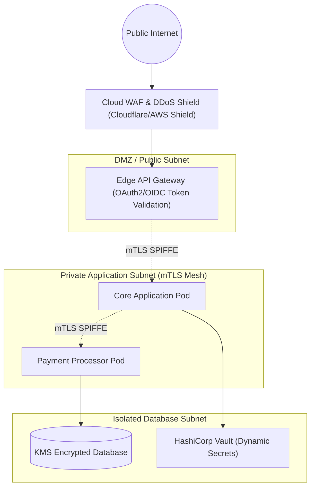

# Security Architecture & Threat Model: [System / Platform]

> **System Name**: [System Name]  
> **Security Lead / Architect**: [Name / Title]  
> **Classification**: [Confidential / Restricted / Public]  
> **Status**: [Draft | In-Review | Approved]  
> **Date**: [YYYY-MM-DD]  
> **Regulatory Scope**: [GDPR, HIPAA, PCI-DSS Level 1, SOC 2 Type II]

---

## 1. Security Architecture Overview & Zero Trust Posture

*Describe the system's security perimeter, identity models, network segmentation, and defense-in-depth posture.*

---

## 2. STRIDE Threat Modeling Analysis

Systematic threat analysis covering the six STRIDE categories across critical system components:

| Category | Threat Scenario | Impact | Likelihood | Mitigation Strategy |
| :--- | :--- | :---: | :---: | :--- |
| **S - Spoofing** | Attacker impersonates an authenticated service to invoke payment API | High | Med | Mandatory mTLS with mutual x509 certificate validation via Istio / SPIFFE. |
| **T - Tampering** | Attacker intercepts and modifies transaction payload in transit | High | Low | TLS 1.3 enforced on all connections; HMAC-SHA256 signatures on webhooks. |
| **R - Repudiation** | User denies initiating a high-value money transfer | High | Low | Cryptographically signed, immutable audit log written to write-once (WORM) storage. |
| **I - Information Disclosure**| Database backup leaked exposing customer plain-text passwords/PII | Critical | Low | Passwords hashed using Argon2id; field-level AES-256 envelope encryption for PII. |
| **D - Denial of Service**| Slowloris or layer-7 HTTP flood overwhelms application pods | High | High | Distributed WAF rate limiting; ingress concurrency throttling; autoscaling HPA. |
| **E - Elevation of Privilege**| Standard tenant user accesses admin endpoints by modifying token claims | Critical | Low | Centralized Open Policy Agent (OPA) policy enforcing strict RBAC/ABAC token claim checks. |

---

## 3. Identity, Authentication & Authorization

* **User Authentication**: Enterprise OIDC (Okta / Azure AD / Auth0) issuing signed JWT tokens using RS256 with 15-minute expiration.
* **Service-to-Service Auth (East-West)**: Automated short-lived x509 certificates rotated every 12 hours via SPIFFE/SPIRE and Istio service mesh.
* **Fine-Grained Authorization**: Attribute-Based Access Control (ABAC) validating:
  * Tenant isolation (`claims.tenant_id == resource.tenant_id`).
  * Explicit role permissions (`roles.includes("PAYMENT_APPROVER")`).
  * Contextual limits (e.g., maximum transfer amount without 2FA step-up).

---

## 4. Cryptographic Engineering & Secrets Management

### 4.1 Cryptographic Standards

| Usage | Algorithm / Protocol | Key Size | Key Storage |
| :--- | :--- | :--- | :--- |
| **Data in Transit** | TLS 1.3 only (Disable TLS 1.0, 1.1, 1.2) | ECDHE-RSA / ECDSA | Automated Let's Encrypt / ACM |
| **Data at Rest** | AES-256-GCM | 256-bit | AWS KMS / Azure Key Vault (HSM-backed) |
| **Password Hashing**| Argon2id (m=65536, t=3, p=4) | 256-bit salt | Local database hash |
| **API Signing** | HMAC-SHA256 | 256-bit key | Vault Dynamic Secret |

### 4.2 Secrets Management Lifecycle
* **Zero Hardcoded Secrets**: Prohibit secrets in Git repositories, Dockerfiles, or environment variables.
* **Dynamic Generation**: Application pods authenticate to HashiCorp Vault via Kubernetes Service Account tokens; Vault generates ephemeral database credentials with a 1-hour time-to-live (TTL).

---

## 5. Security Testing, Vulnerability Management & Compliance

* **SAST (Static Analysis)**: Semgrep / SonarQube integrated into CI pipeline; blocks build on any `High` or `Critical` issue.
* **SCA (Software Composition Analysis)**: Snyk / Dependabot scanning third-party dependencies; 0-day CVE alerts trigger immediate triage.
* **DAST (Dynamic Analysis)**: Weekly OWASP ZAP automated penetration scans on staging environments.
* **Container Security**: Base images built on Google Distroless or Alpine Linux; vulnerability scanning via Trivy.
