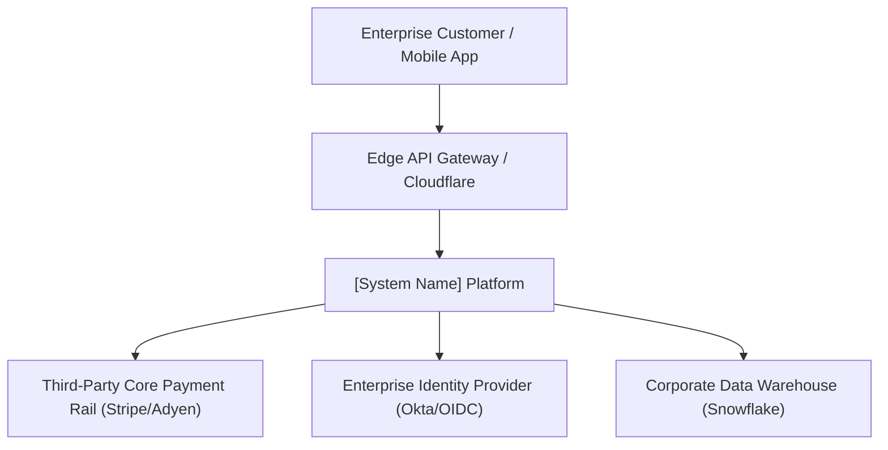
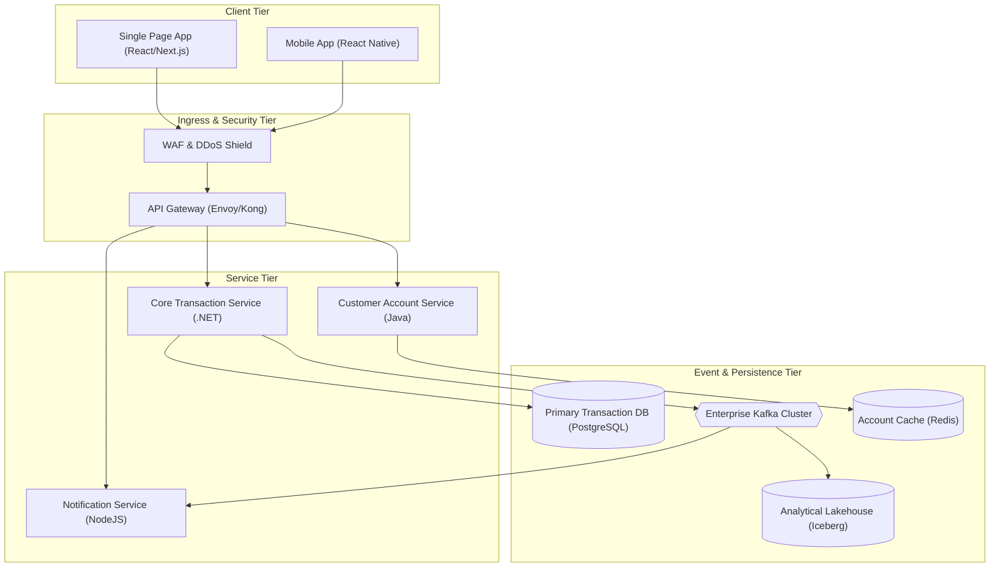
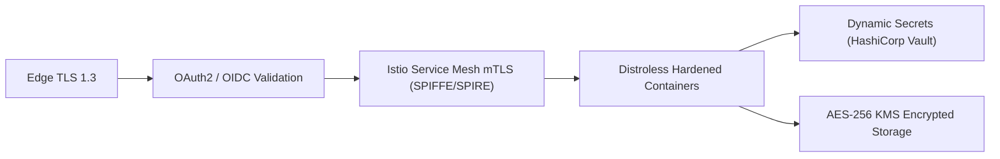

# Solution Architecture Document (SAD): [System / Initiative Name]

> **Project / Initiative**: [Name]  
> **Architecture Lead**: [Name / Title]  
> **Status**: [Draft | Under Review | Approved | Superseded]  
> **Version**: [1.0.0]  
> **Date**: [YYYY-MM-DD]  
> **ARB Review Date**: [YYYY-MM-DD]  
> **Target Production Release**: [YYYY-QX]

---

## 1. Executive Summary & Business Context

### 1.1 Business Problem Statement
*Articulate the fundamental business problem, market opportunity, or operational deficiency this solution addresses.*

### 1.2 Strategic Goals & Business KPIs
* **Goal 1**: [e.g., Enable real-time payments across 5 European countries]
* **Goal 2**: [e.g., Reduce customer onboarding time from 3 days to under 5 minutes]
* **KPI Metrics**: [e.g., +25% Transaction Volume, 99.99% Availability, $0.02 cost-per-transaction]

---

## 2. Requirements & Scope Boundaries

### 2.1 In-Scope Capabilities
* [Capability 1]
* [Capability 2]
* [Capability 3]

### 2.2 Out-of-Scope Capabilities (Phase 1)
* [Explicitly list what will NOT be delivered in this phase]

### 2.3 Non-Functional Requirements (NFR Matrix)

| NFR Category | Metric / Target Threshold | Measurement Method |
| :--- | :--- | :--- |
| **p95 Latency** | `< 120ms` for critical transactional APIs | APM Distributed Traces |
| **p99 Latency** | `< 250ms` under peak traffic load | Synthetic Gateway Probes |
| **Throughput** | `5,000 requests/sec` sustained; `12,000 rps` peak | Distributed Load Tests |
| **Availability** | `99.99%` (Max 52.6 min unplanned downtime/yr) | External Multi-Region Probes |
| **RPO (Recovery Point)** | `< 1 minute` (Data loss window) | Database Replication Lag |
| **RTO (Recovery Time)** | `< 15 minutes` (Full failover to secondary region)| DR Automated Cutover Drill |
| **Data Retention** | 7 Years encrypted cold archive | S3/Blob Lifecycle Automation |

### 2.4 Architectural Constraints
* **Compliance**: GDPR, PCI-DSS Level 1, SOC 2 Type II.
* **Hosting**: Primary on AWS (eu-west-1), Secondary on AWS (eu-central-1).
* **Stack**: Core backend services in .NET 8 / C# or Java 21 LTS.

---

## 3. System Architecture & C4 Visuals

### 3.1 C4 Level 1: System Context Diagram
*Shows how this platform fits into the enterprise landscape, interacting with external users and third-party systems.*

### 3.2 C4 Level 2: Container Topology Diagram
*Decomposes the system into deployable containers (APIs, frontends, databases, message queues).*

---

## 4. Key Architectural Decisions (ADR Register)

| ADR Number | Decision Title | Status | Primary Impact |
| :--- | :--- | :--- | :--- |
| [ADR-0001](adr/) | Adopt Event-Driven Choreography via Kafka | Accepted | Asynchronous decoupling of order settlement |
| [ADR-0002](adr/) | PostgreSQL with Patroni for High Availability | Accepted | Multi-AZ active-passive automatic failover |
| [ADR-0003](adr/) | OAuth2 + mTLS for Zero Trust Service Mesh | Accepted | Enforces mutual authentication on east-west calls |

---

## 5. Data Architecture & Persistence Strategy

### 5.1 Polyglot Storage Strategy
* **Transactional State**: PostgreSQL with row-level security and JSONB indexing.
* **Cache & Rate Limiting**: Managed Redis Cluster with multi-AZ replication and Redis Sentinel.
* **Event Stream**: Apache Kafka with 7-day retention and log compaction for entity changelogs.
* **Analytical Ingestion**: Change Data Capture (Debezium) streaming database mutations into Snowflake.

### 5.2 Sharding & Partitioning Strategy
* *Sharding Key*: `TenantID` + `Hash(CustomerID)` to guarantee co-location of tenant queries.
* *Partitioning*: Monthly table range partitioning on high-volume transaction audit logs.

---

## 6. Integration Architecture & Contracts

* **Synchronous APIs**: RESTful JSON over HTTPS / HTTP/2 complying with OpenAPI 3.1 specs.
* **Inter-Service Mesh**: High-throughput binary gRPC over HTTP/2 for latency-sensitive RPC calls.
* **Asynchronous Events**: CloudEvents-compliant JSON/Avro schemas governed via Confluent Schema Registry.
* **Idempotency**: All mutating operations require a unique `Idempotency-Key` header stored in Redis with a 24-hour TTL.

---

## 7. Security & Zero Trust Architecture

* **Authentication**: Enterprise Okta OIDC for users; SPIFFE/SPIRE x509 certificates for service-to-service mTLS.
* **Authorization**: Open Policy Agent (OPA) evaluating RBAC and ABAC policies at API Gateway.
* **Secrets Management**: Dynamic short-lived credentials fetched via HashiCorp Vault. Zero hardcoded secrets.
* **Data Protection**: TLS 1.3 in-transit; AES-256 GCM envelope encryption with customer-managed keys (CMK) at-rest.

---

## 8. Observability & SRE Governance

* **Distributed Tracing**: OpenTelemetry SDK injecting W3C `traceparent` context across all HTTP, gRPC, and Kafka headers.
* **Metrics**: Prometheus scraping `/metrics` endpoints; Grafana dashboards tracking the RED method (Rate, Errors, Duration).
* **Logging**: Structured JSON logs streamed to Elasticsearch/OpenSearch with mandatory fields (`trace_id`, `span_id`, `tenant_id`, `service_name`).
* **SLO Burn Rate Alerting**: Multi-window multi-burn-rate alerts connected to PagerDuty for on-call escalation.

---

## 9. Infrastructure, Cloud Topology & Disaster Recovery

* **Cloud Topology**: Multi-AZ Active-Active inside AWS Region 1 (eu-west-1); Warm Standby in Region 2 (eu-central-1).
* **Compute**: Managed Kubernetes (EKS) with Karpenter autoscaling, topology spread constraints across 3 Availability Zones.
* **Disaster Recovery Strategy**: Pilot Light failover using Route 53 DNS routing policies and asynchronous database replication.

---

## 10. Cost Estimation & FinOps Model

| Cost Component | Monthly Cost (Baseline) | Monthly Cost (Peak 3x) | Cost Optimization Levers |
| :--- | :--- | :--- | :--- |
| **Compute (EKS Nodes)** | $2,400 | $6,200 | Karpenter Graviton (ARM64) + 60% Spot Nodes |
| **Managed DB (PostgreSQL)**| $1,800 | $2,800 | 3-Year Reserved Instances |
| **Messaging (Kafka)** | $1,200 | $2,000 | Log compaction, tiered S3 storage |
| **Networking & Egress** | $800 | $2,200 | VPC Endpoints, AZ co-location |
| **TOTAL (Monthly)** | **$6,200** | **$13,200** | Estimated annual spend: ~$85,000 |

---

## 11. Technical Risk & Mitigation Summary

| Risk ID | Description | Impact | Prob. | Mitigation Strategy |
| :--- | :--- | :---: | :---: | :--- |
| **R-01** | Third-party payment gateway latency spikes | High | Med | Circuit breaker with 2s timeout; fallback to secondary payment provider. |
| **R-02** | Kafka partition imbalance during flash sale | High | Low | Custom Murmur3 partitioning key distributing tenant traffic evenly. |
| **R-03** | Regulatory GDPR audit non-compliance | Critical| Low | Automated data pseudonymization pipeline and automated 30-day purge jobs. |

---

## 12. Sign-off & Architecture Review Board Approval

| Reviewer Role | Name | Decision | Date | Signature / Notes |
| :--- | :--- | :---: | :---: | :--- |
| **Lead Solution Architect** | [Name] | Approved | YYYY-MM-DD | Core architecture complete |
| **Enterprise Architect** | [Name] | Approved | YYYY-MM-DD | Aligned with enterprise standards |
| **Chief Information Security Officer (CISO)** | [Name] | Approved | YYYY-MM-DD | Zero trust & STRIDE approved |
| **Principal SRE / Infrastructure Lead** | [Name] | Approved | YYYY-MM-DD | DR and telemetry approved |
| **Head of Engineering** | [Name] | Approved | YYYY-MM-DD | Delivery timelines aligned |
