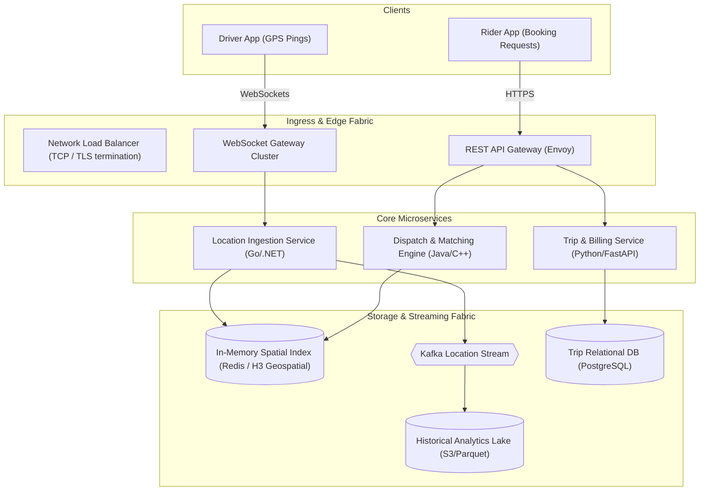

# System Design Specification: [System / Challenge Name]

> **System Name**: [e.g., Global Distributed Web Crawler / Distributed Rate Limiter / Ride-Hailing Dispatch]  
> **Author**: [Principal Engineer / System Architect]  
> **Status**: [Draft | Review | Approved]  
> **Context**: [Production Greenfield Architecture / Interview System Design Reference]

---

## 1. Requirements Exploration & Scope

### 1.1 Functional Requirements
* Users must be able to [Core Capability 1, e.g., submit a ride request with origin and destination].
* System must [Core Capability 2, e.g., match rider with closest available driver within 5 seconds].
* System must [Core Capability 3, e.g., track driver GPS coordinates in real-time].

### 1.2 Non-Functional Requirements (NFRs)
* **Latency**: Matching response `< 500ms` at p99; driver location update latency `< 1,000ms`.
* **Throughput**: 100,000 active concurrent drivers emitting location every 4 seconds = 25,000 writes/second.
* **Availability**: 99.99% availability (Highly Available over Strong Consistency for telemetry).
* **Durability**: Zero ride transaction data loss.

---

## 2. Back-of-the-Envelope Capacity Estimation

```text
┌─────────────────────────────────────────────────────────────┐
│                 CAPACITY ESTIMATION CALCULATIONS            │
├─────────────────────────────────────────────────────────────┤
│ 1. Active Concurrent Drivers: 100,000                       │
│ 2. GPS Ping Frequency: Every 4 seconds                      │
│ 3. Ingestion Write RPS: 100,000 / 4 = 25,000 writes/sec     │
│ 4. Payload Size per Ping: {driverId, lat, lon, ts} = 64 B   │
│ 5. Network Ingress: 25,000 * 64 Bytes = 1.6 MB/sec          │
│ 6. Daily Storage: 1.6 MB/s * 86,400s ≈ 138 GB / day         │
│ 7. 1-Year Storage: ~50 TB uncompressed                     │
│ 8. In-Memory Working Set (Active Drivers): 100k * 64B ≈ 6.4MB│
│    (Can fit entirely in a single Redis / Memcached node)     │
└─────────────────────────────────────────────────────────────┘
```

---

## 3. High-Level Architecture Topology



---

## 4. Deep-Dive Design: Core Subsystems & Data Structures

### 4.1 Geospatial Indexing Strategy (Uber H3 / QuadTree / S2)
* **Problem**: How to query all available drivers within a 3km radius at 25,000 writes/sec?
* **Solution**: Discretize earth into hexagonal grid cells using **Uber H3 (Resolution 8: ~460m radius)**.
* **Storage Structure**: In-memory Redis Set keyed by `h3_index`.
  * Write: Driver sends lat/lon -> Map to `h3_index` -> `SADD h3:<index> driverId`.
  * Read: Rider sends lat/lon -> Query `h3_index` and 6 neighboring cells (`kRing(index, 1)`) -> Retrieve union of driver IDs.

---

## 5. Failure Modes, Scalability Bottlenecks & Trade-offs

| Scenario / Bottleneck | Potential Impact | Architectural Mitigation |
| :--- | :--- | :--- |
| **Hotspot H3 Hexagon (e.g. Airport/Concert)** | 5,000 drivers in a single cell causing Redis lock contention | Read replication on Redis cluster; rate limit driver GPS updates when stationary. |
| **WebSocket Gateway Pod Crashes** | 10,000 drivers disconnect simultaneously | Client backoff with randomized jitter reconnect; stateless WS gateways reconnecting to Redis. |
| **Split-Brain Driver Assignment** | Two riders matched to same driver concurrently | Distributed lock in Redis with 3-second lease using Redlock algorithm or database CAS query. |

---

## 6. Resilience, Security & Observability

* **Idempotency**: Booking requests enforce `Idempotency-Key` preventing duplicate charges.
* **Telemetry**: Latency tracked per H3 cell; Prometheus histogram for ride matching duration.
* **Security**: mTLS on internal service mesh; location data anonymized in analytical cold storage.
