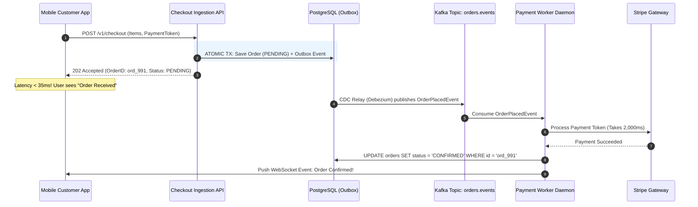

# ADR-0005: Synchronous Request-Response vs. Asynchronous Event-Driven Order Processing

## Metadata
- **Status**: Accepted
- **Date**: 2026-09-05
- **Author(s)**: Lead Solution Architect (E-Commerce Domain)
- **Deciders**: Architecture Review Board (ARB), VP of E-Commerce Engineering
- **Technical Story**: [ARCH-1135] Flash-Sale Checkout Resilience

---

## 1. Context and Problem Statement

During the recent Black Friday sales event, our e-commerce checkout platform experienced a catastrophic 45-minute outage. 

Post-incident investigation revealed that the checkout flow was implemented as a **deep synchronous HTTP chain**:
$$\text{Mobile App} \rightarrow \text{Checkout API} \rightarrow \text{Fraud Service} \rightarrow \text{Inventory Service} \rightarrow \text{Payment Gateway (Stripe)} \rightarrow \text{Email Service}$$

When third-party payment gateway latency increased from 150ms to 4,000ms due to upstream network congestion:
1. All worker threads across the Checkout API and Inventory Service became blocked waiting on HTTP responses.
2. Connection pools to the primary database were exhausted within 90 seconds.
3. Over **$2.4M in retail orders were abandoned** due to browser timeout errors (`HTTP 504 Gateway Timeout`).

We must redesign the checkout transaction pipeline to survive upstream partner degradations and handle surge loads of up to **10,000 checkout submissions/second**.

---

## 2. Decision Drivers

- **Driver 1: Ingestion Resilience**: Checkout API must never reject orders or crash due to downstream third-party slowness.
- **Driver 2: Temporal Decoupling**: Downstream services (Email, Fraud, Loyalty, Analytics) must process work asynchronously without blocking checkout.
- **Driver 3: Customer User Experience**: Customers must receive immediate feedback that their order has been securely received within **$\le 200\text{ms}$**.
- **Driver 4: Guaranteed Delivery**: Zero dropped orders under network partitions or worker crashes.

---

## 3. Considered Options

- **Option A**: Optimized Synchronous REST with Circuit Breakers (Resilience4j / Polly) and thread pool bulkheads.
- **Option B**: **Asynchronous Event-Driven Ingestion with Apache Kafka and Transactional Outbox Pattern**.
- **Option C**: Point-to-Point Queueing with AWS SQS and Lambda Workers.

---

## 4. Comparative Evaluation Matrix

| Decision Criteria | Option A: Sync REST + Circuit Breakers | Option B: Event-Driven Kafka + Outbox | Option C: AWS SQS + Lambda |
|:---|:---:|:---:|:---:|
| **Peak Surge Absorption** | Poor (Threads still block under load) | **Exceptional (Buffers millions of events safely)**| Exceptional (Queue buffering) |
| **Ingress Latency (p99)** | Unpredictable (200ms – 5,000ms) | **Predictable (< 50ms to append to Kafka)**| Predictable (< 50ms) |
| **Fault Isolation** | Moderate (Tripping breakers drops features) | **High (Downstream outages do not impact ingest)** | High |
| **Event Replay & Auditing** | None | **Native (Kafka log retention & replay)**| None (Messages deleted on ACK)|
| **Operational Simplicity** | High (Standard REST) | Moderate (Requires Kafka governance) | High (Fully managed SaaS) |
| **Consistency Model** | Immediate Consistency | **Eventual Consistency (1-2s lag)** | Eventual Consistency |

---

## 5. Decision Outcome

**Chosen Option**: **Option B: Asynchronous Event-Driven Ingestion with Apache Kafka and Transactional Outbox**

### Rationale and Justification
Asynchronous event-driven architecture eliminates the fatal flaw of distributed synchronous request-response: **temporal coupling**. 

Under this design:
1. When a customer taps "Place Order", the Checkout API validates basic payload syntax and immediately persists the order with status `PENDING` into the local database and `outbox_table` in a single atomic local transaction.
2. The Checkout API immediately returns `HTTP 202 Accepted` with an `order_id` to the mobile app in **under 35 milliseconds**.
3. Debezium streams the `OrderPlaced` event to the `orders.v1` Kafka topic.
4. Independent consumer microservices (Payment Worker, Inventory Worker, Notification Worker) consume and process the event at their own optimal pace. If Stripe slows down, events simply buffer safely on the Kafka partition disk without dropping a single order.

---

## 6. Consequences & Trade-Offs

### Positive Consequences
- **Elimination of Cascading Outages**: Third-party payment gateway latency or downtime no longer crashes the customer-facing checkout API.
- **Load Leveling**: Kafka acts as a massive shock absorber, flattening a spike of 10,000 TPS into a smooth, steady stream that backend services can process without exhausting resources.
- **Temporal Decoupling**: Adding new downstream consumers (e.g., Marketing, Fraud ML) requires zero changes to the Checkout Service.

### Negative Consequences
- **Eventual Consistency**: The mobile client no longer receives a synchronous "Payment Success" response. 
  - *Mitigation*: The mobile UI displays an animated "Order Received! We are confirming your payment..." screen while listening on a WebSocket or polling the `/orders/{id}/status` endpoint for final confirmation.
- **Idempotency Mandate**: Consumers must implement idempotent processing using `idempotency_key` to safely handle Kafka message redeliveries.

---

## 7. Compliance & Sequence Diagram

