# Architecture Decision Records (ADR) Repository

## Overview

This directory contains the immutable, version-controlled **Architecture Decision Records (ADRs)** for the enterprise platform. An Architecture Decision Record captures an important architectural decision made along with its context, considered alternatives, evaluation criteria, decision outcome, and resulting consequences.

ADRs are living history: they capture *why* the architecture is structured the way it is, preventing organizational amnesia, easing new engineer onboarding, and preventing teams from re-litigating settled technical debates.

---

## ADR Index

| ADR ID | Title | Status | Date | Decision Summary |
|:---|:---|:---:|:---:|:---|
| [ADR-0001](ADR-0001-template.md) | Standard Enterprise Architecture Decision Record Template | **Active** | 2026-09-01 | Baseline template specification for all ADRs. |
| [ADR-0002](ADR-0002-example-modular-monolith-vs-microservices.md) | Adoption of Modular Monolith Architecture for Core Ingestion | **Accepted** | 2026-09-05 | Adopted Modular Monolith over distributed Microservices for initial launch. |
| [ADR-0003](ADR-0003-example-rest-vs-grpc.md) | Adoption of gRPC for Internal Microservice Communication | **Accepted** | 2026-09-05 | Adopted gRPC/Protobuf over REST/JSON for inter-service RPC. |
| [ADR-0004](ADR-0004-example-sql-vs-nosql.md) | Database Strategy: PostgreSQL for OLTP Ledger vs DynamoDB | **Accepted** | 2026-09-05 | Selected PostgreSQL Multi-AZ with schema isolation for financial data. |
| [ADR-0005](ADR-0005-example-sync-vs-async.md) | Asynchronous Event-Driven Order Processing via Kafka | **Accepted** | 2026-09-05 | Replaced synchronous checkout chains with asynchronous Kafka event streaming. |

---

## ADR Lifecycle Management

```mermaid
stateDiagram-v2
    [*] --> Proposed: Authored by Architect / Tech Lead
    Proposed --> UnderReview: RFC Period with Engineering Teams
    UnderReview --> Accepted: Ratified by Architecture Review Board
    UnderReview --> Rejected: Deemed unviable; rationale documented
    Accepted --> Deprecated: Technology phased out
    Accepted --> Superseded: Replaced by newer ADR (e.g. ADR-0024)
    Deprecated --> [*]
    Rejected --> [*]
```

### Governing Principles
1. **Immutable Historical Record**: Once an ADR status becomes `Accepted` and merges to `main`, its decision and rationale text must **never be retroactively edited**.
2. **Superseding Decisions**: If requirements change or a technology is replaced, author a **new** ADR (e.g., `ADR-0012`) that explicitly references and supersedes the old record (`Supersedes ADR-0003`).
3. **Commit with Code**: Keep ADRs in the same Git repository as the code they govern, submitted via standard pull requests with required peer approvals.
