# Architecture Decision Records (ADR) Repository

## Overview

This directory contains the immutable, version-controlled **Architecture Decision Records (ADRs)** for the enterprise platform. An Architecture Decision Record captures an important architectural decision made along with its context, considered alternatives, evaluation criteria, decision outcome, and resulting consequences.

ADRs are living history: they capture *why* the architecture is structured the way it is, preventing organizational amnesia, easing new engineer onboarding, and preventing teams from re-litigating settled technical debates.

---

## ADR Index by Architecture Domain

### Core Foundation & Examples (Phases 1-3)

| ADR ID | Title | Status | Date |
| :--- | :--- | :---: | :---: |
| [ADR-0001](ADR-0001-template.md) | Enterprise Architecture Decision Record Template | **Accepted** | 2026-09-05 |
| [ADR-0002](ADR-0002-example-modular-monolith-vs-microservices.md) | Modular Monolith vs. Microservices for Core Order Management Platform | **Accepted** | 2026-09-05 |
| [ADR-0003](ADR-0003-example-rest-vs-grpc.md) | gRPC vs. REST for Internal Microservice Communication | **Accepted** | 2026-09-05 |
| [ADR-0004](ADR-0004-example-sql-vs-nosql.md) | Relational PostgreSQL vs. NoSQL DynamoDB for Financial Ledger | **Accepted** | 2026-09-05 |
| [ADR-0005](ADR-0005-example-sync-vs-async.md) | Synchronous Request-Response vs. Asynchronous Event-Driven Order Processing | **Accepted** | 2026-09-05 |

### Application Architecture (Phase 4)

| ADR ID | Title | Status | Date |
| :--- | :--- | :---: | :---: |
| [ADR-0010](ADR-0010-modular-monolith-vs-microservices.md) | Adoption of Modular Monolith Architecture Before Microservices | **Accepted** | 2026-09-05 |
| [ADR-0011](ADR-0011-clean-architecture-adoption.md) | Standardizing on Clean Architecture for Core Domain Services | **Accepted** | 2026-09-05 |
| [ADR-0012](ADR-0012-dotnet-vs-java-backend-platform.md) | Backend Runtime Selection Criteria: .NET Core vs Java Virtual Machine | **Accepted** | 2026-09-05 |
| [ADR-0013](ADR-0013-react-vs-angular-enterprise-standard.md) | Frontend Framework Selection: React for Customer-Facing vs Angular for Core Operations | **Accepted** | 2026-09-05 |
| [ADR-0014](ADR-0014-fastapi-for-ai-workloads.md) | FastAPI as Standard Gateway for AI and Machine Learning Microservices | **Accepted** | 2026-09-05 |
| [ADR-0015](ADR-0015-state-management-strategy-frontend.md) | Separation of Server State and Client State in Web Applications | **Accepted** | 2026-09-05 |
| [ADR-0016](ADR-0016-cross-platform-mobile-react-native.md) | Cross-Platform Mobile Strategy: React Native for Enterprise Apps | **Accepted** | 2026-09-05 |
| [ADR-0017](ADR-0017-transactional-outbox-event-publication.md) | Transactional Outbox Pattern for Reliable Distributed Domain Events | **Accepted** | 2026-09-05 |
| [ADR-0018](ADR-0018-anti-corruption-layer-legacy-integration.md) | Mandatory Anti-Corruption Layer for Legacy System Integrations | **Accepted** | 2026-09-05 |
| [ADR-0019](ADR-0019-strangler-fig-for-monolith-modernization.md) | Strangler Fig Pattern for Legacy Monolith Modernization | **Accepted** | 2026-09-05 |
| [ADR-0020](ADR-0020-contract-testing-with-pact.md) | Consumer-Driven Contract Testing Adoption with Pact | **Accepted** | 2026-09-05 |

### Data & Integration Architecture (Phase 5)

| ADR ID | Title | Status | Date |
| :--- | :--- | :---: | :---: |
| [ADR-0021](ADR-0021-database-per-service-vs-shared-database.md) | Database-per-Service vs Shared Database Pattern | **Accepted** | 2026-09-05 |
| [ADR-0022](ADR-0022-sql-vs-nosql-database-selection.md) | Relational SQL vs NoSQL Database Selection Policy | **Accepted** | 2026-09-05 |
| [ADR-0023](ADR-0023-kafka-vs-rabbitmq-messaging-platform.md) | Enterprise Messaging Platform Selection: Kafka vs RabbitMQ | **Accepted** | 2026-09-05 |
| [ADR-0024](ADR-0024-rest-vs-grpc-internal-microservices.md) | gRPC Adoption for Internal High-Throughput Inter-Service RPC | **Accepted** | 2026-09-05 |
| [ADR-0025](ADR-0025-rest-vs-graphql-frontend-integration.md) | REST vs GraphQL for Frontend Application Integration | **Accepted** | 2026-09-05 |
| [ADR-0026](ADR-0026-cdc-vs-application-synchronization.md) | Log-Based CDC over Application Dual-Writing for Data Sync | **Accepted** | 2026-09-05 |
| [ADR-0027](ADR-0027-data-lake-vs-data-warehouse-vs-lakehouse.md) | Data Lakehouse Architecture Adoption with Apache Iceberg | **Accepted** | 2026-09-05 |
| [ADR-0028](ADR-0028-batch-vs-streaming-data-pipelines.md) | Stream-First vs Batch Data Pipeline Selection Criteria | **Accepted** | 2026-09-05 |
| [ADR-0029](ADR-0029-centralized-api-gateway-adoption.md) | Centralized API Gateway for Perimeter Ingress Governance | **Accepted** | 2026-09-05 |
| [ADR-0030](ADR-0030-backend-for-frontend-bff-pattern.md) | Adoption of Backend-for-Frontend (BFF) Pattern for Client Channels | **Accepted** | 2026-09-05 |
| [ADR-0031](ADR-0031-eventual-consistency-in-distributed-domains.md) | Eventual Consistency Governance in Distributed Bounded Contexts | **Accepted** | 2026-09-05 |
| [ADR-0032](ADR-0032-transactional-outbox-event-publishing.md) | Mandatory Transactional Outbox Pattern for Domain Event Publishing | **Accepted** | 2026-09-05 |
| [ADR-0033](ADR-0033-saga-orchestration-vs-choreography.md) | Orchestrated Sagas for Complex Multi-Step Business Workflows | **Accepted** | 2026-09-05 |
| [ADR-0034](ADR-0034-data-mesh-organizational-adoption.md) | Data Mesh Evaluation & Domain Ownership Criteria | **Accepted** | 2026-09-05 |
| [ADR-0035](ADR-0035-point-to-point-vs-enterprise-integration-platform.md) | API-Led Integration over Point-to-Point Spaghetti | **Accepted** | 2026-09-05 |
| [ADR-0036](ADR-0036-centralized-vs-decentralized-integration-governance.md) | Federated Integration Governance Model | **Accepted** | 2026-09-05 |
| [ADR-0037](ADR-0037-financial-reconciliation-engine-architecture.md) | Automated Daily Multi-Way Financial Reconciliation | **Accepted** | 2026-09-05 |
| [ADR-0038](ADR-0038-batch-vs-real-time-reconciliation.md) | Dual Batch and Near-Real-Time Reconciliation Strategy | **Accepted** | 2026-09-05 |
| [ADR-0039](ADR-0039-exact-vs-rule-based-reconciliation-matching.md) | Deterministic Rule-Based Matching over Fuzzy Matching in Reconciliation | **Accepted** | 2026-09-05 |
| [ADR-0040](ADR-0040-settlement-source-of-truth.md) | Formal Settlement Source-of-Truth Determination | **Accepted** | 2026-09-05 |
| [ADR-0041](ADR-0041-financial-event-idempotency-keys.md) | Mandatory Client-Supplied Idempotency Keys on Financial Operations | **Accepted** | 2026-09-05 |
| [ADR-0042](ADR-0042-open-table-format-apache-iceberg.md) | Adoption of Apache Iceberg as Standard Open Table Format | **Accepted** | 2026-09-05 |
| [ADR-0043](ADR-0043-contract-first-api-governance.md) | Contract-First API Design & CI Verification | **Accepted** | 2026-09-05 |

### Cloud & Infrastructure Architecture (Phase 6)

| ADR ID | Title | Status | Date |
| :--- | :--- | :---: | :---: |
| [ADR-0044](ADR-0044-cloud-provider-primary-selection.md) | Standardization on AWS as Primary Enterprise Cloud Provider | **Accepted** | 2026-09-05 |
| [ADR-0045](ADR-0045-multi-account-landing-zone-structure.md) | Adoption of Multi-Account AWS Control Tower Landing Zone | **Accepted** | 2026-09-05 |
| [ADR-0046](ADR-0046-hub-and-spoke-transit-gateway-networking.md) | Hub-and-Spoke Networking via AWS Transit Gateway | **Accepted** | 2026-09-05 |
| [ADR-0047](ADR-0047-workload-compute-runtime-standardization.md) | Compute Runtime Standardization on Serverless Containers and EKS | **Accepted** | 2026-09-05 |
| [ADR-0048](ADR-0048-managed-kubernetes-with-karpenter.md) | Adoption of Amazon EKS with Karpenter Node Autoscaling | **Accepted** | 2026-09-05 |
| [ADR-0049](ADR-0049-relational-database-aurora-adoption.md) | Adoption of Amazon Aurora PostgreSQL as Standard Relational Engine | **Accepted** | 2026-09-05 |
| [ADR-0050](ADR-0050-in-memory-caching-redis-cluster.md) | Standardization on Redis Cluster (ElastiCache) for Distributed Caching | **Accepted** | 2026-09-05 |
| [ADR-0051](ADR-0051-event-streaming-managed-kafka-msk.md) | Standardization on Amazon MSK for Enterprise Event Streaming | **Accepted** | 2026-09-05 |
| [ADR-0052](ADR-0052-zero-trust-identity-as-perimeter.md) | Adoption of Zero Trust Network Architecture and Identity-Aware Proxies | **Accepted** | 2026-09-05 |
| [ADR-0053](ADR-0053-workload-identity-federation-standard.md) | Elimination of Static Cloud API Keys via Workload Identity Federation | **Accepted** | 2026-09-05 |
| [ADR-0054](ADR-0054-immutable-declarative-iac-terraform.md) | Standardization on Terraform / OpenTofu for 100% Declarative IaC | **Accepted** | 2026-09-05 |
| [ADR-0055](ADR-0055-internal-developer-platform-and-golden-paths.md) | Establishment of Platform Engineering Team & Golden Paths | **Accepted** | 2026-09-05 |
| [ADR-0056](ADR-0056-multi-az-quorum-and-warm-standby-dr.md) | Multi-AZ Primary Deployment with Cross-Region Warm Standby DR | **Accepted** | 2026-09-05 |
| [ADR-0057](ADR-0057-finops-unit-cost-allocation-mandate.md) | Mandatory FinOps Tagging and Unit Economics Cost Allocation | **Accepted** | 2026-09-05 |
| [ADR-0058](ADR-0058-opentelemetry-unified-telemetry-standard.md) | Standardization on OpenTelemetry (OTel) for Distributed Observability | **Accepted** | 2026-09-05 |
| [ADR-0059](ADR-0059-database-migration-cdc-reverse-replication.md) | Zero-Downtime Database Migration via CDC and Reverse Replication | **Accepted** | 2026-09-05 |
| [ADR-0060](ADR-0060-rejection-of-premature-active-active-multi-cloud.md) | Rejection of Active-Active Multi-Cloud for Transactional Workloads | **Accepted** | 2026-09-05 |

---

## ADR Lifecycle Management

```mermaid
stateDiagram-v2
    [*] --> Proposed: Authored by Architect / Tech Lead
    Proposed --> UnderReview: RFC Period with Engineering Teams
    UnderReview --> Accepted: Ratified by Architecture Review Board
    UnderReview --> Rejected: Deemed unviable; rationale documented
    Accepted --> Deprecated: Technology phased out
    Accepted --> Superseded: Replaced by newer ADR (e.g. ADR-0024)
    Deprecated --> [*]
    Rejected --> [*]
```

### Governing Principles
1. **Immutable Historical Record**: Once an ADR status becomes `Accepted` and merges to `main`, its decision and rationale text must **never be retroactively edited**.
2. **Superseding Decisions**: If requirements change or a technology is replaced, author a **new** ADR (e.g., `ADR-0012`) that explicitly references and supersedes the old record (`Supersedes ADR-0003`).
3. **Commit with Code**: Keep ADRs in the same Git repository as the code they govern, submitted via standard pull requests with required peer approvals.
