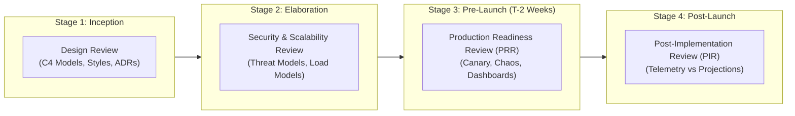

# Enterprise Architecture Review Framework

## Overview

The Enterprise Architecture Review Framework governs the formal review, evaluation, and approval of technical architectures across the enterprise. It ensures that software systems adhere to corporate principles, comply with security baselines, maintain production scalability, and utilize approved paved-road technologies prior to capital investment and production deployment.

Architecture reviews are not bureaucratic gatekeepers intended to slow delivery; they are collaborative, high-value peer-review sessions that identify catastrophic structural blind spots, optimize multi-million dollar cloud expenditures, and accelerate delivery velocity.

---

## Architecture Review Deliverables Index

| Document | Purpose & Lifecycle Stage | Target Audience |
|:---|:---|:---|
| [Review Process](architecture-review-process.md) | End-to-end workflow, intake, hearing stages, and determination governance | Architects, Engineering Managers |
| [Review Checklist](architecture-review-checklist.md) | Universal multi-domain architectural evaluation checklist | Lead Architects, Review Boards |
| [Design Review](design-review.md) | Inception-phase structural evaluation (Bounded contexts, styles, contracts) | Solution Architects, Tech Leads |
| [Security Review](security-review.md) | STRIDE threat modeling, zero-trust validation, cryptographic controls | InfoSec, CISO, Security Champions |
| [Scalability Review](scalability-review.md) | Capacity planning, bottleneck identification, database sharding, IOPS | SRE, Performance Engineers |
| [Production Readiness Review](production-readiness-review.md) | Pre-launch operational verification (Telemetry, runbooks, chaos drills) | DevOps, SRE, On-Call Engineers |
| [Architecture Sign-Off](architecture-sign-off.md) | Formal executive governance approval and time-bound exception waiver template | Architecture Review Board (ARB) |

---

## Review Gates in the Delivery Lifecycle

