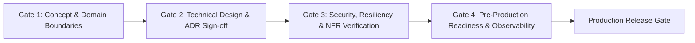

# Enterprise Application Architecture Review Specification

## 1. Executive Purpose
This document establishes the official Architecture Review Board (ARB) framework for assessing, approving, and governing application engineering architectures across the enterprise.

---

## 2. Review Gateways & Phase Alignment

---

## 3. Review Dimensions & Scoring Rubric

### Dimension 1: Domain Boundaries & Modularity (Weight: 25%)
- Strict adherence to DDD principles (bounded contexts, aggregates, entities, value objects).
- Absence of circular dependencies verified via automated fitness rules.
- Public module API surfaces explicitly minimized.

### Dimension 2: Security & Zero-Trust Governance (Weight: 25%)
- Authentication and authorization enforced via enterprise IdP (OAuth2/OIDC).
- Strict defense against OWASP Top 10 vulnerabilities.
- Cryptographic keys, credentials, and secrets stored exclusively in secret management services (Vault / Key Vault).

### Dimension 3: Resilience & Fault Isolation (Weight: 20%)
- All external dependencies protected by timeouts, retries with exponential backoff, and circuit breakers.
- Safe asynchronous integration with transactional outbox and idempotent consumers.
- Graceful degradation paths under downstream failure conditions.

### Dimension 4: Operational Observability (Weight: 15%)
- Structured JSON logging with trace and correlation ID propagation.
- Distributed tracing with OpenTelemetry instrumented across all service boundaries.
- Standard health check endpoints (`/health/live`, `/health/ready`).

### Dimension 5: Testability & Quality Automation (Weight: 15%)
- Balanced test pyramid: fast unit tests for business logic, integration tests for persistence, and contract tests for APIs.
- Automated CI pipeline execution with zero manual intervention required for test verification.
