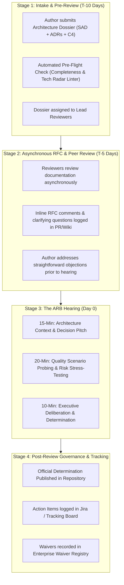
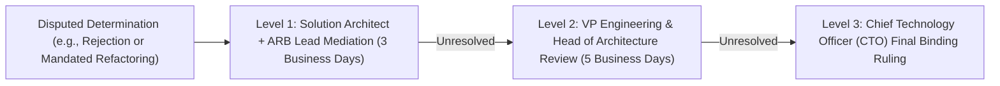

# Architecture Review Process

## Overview

The Architecture Review Process is the operational workflow governing how technical designs are submitted, evaluated, challenged, and ratified by the **Architecture Review Board (ARB)**. In high-velocity engineering organizations, the process must remain lightweight, predictable, and transparent, avoiding the historical stigma of "ivory-tower architecture committees" while providing rigorous enterprise governance.

---

## The 4-Stage Architecture Review Workflow

---

## Review Determination Categories

At the conclusion of the ARB hearing, the board issues one of four formal determinations:

| Determination | Operational Meaning | Impact on Delivery Train |
|:---|:---|:---|
| **Approved** | The architecture strictly conforms to enterprise principles, paved-road stacks, and NFR targets. | Green light; team proceeds directly to sprint execution. |
| **Conditional Approval** | The architectural approach is approved, but specific non-blocking action items must be resolved. | Development may proceed; team must submit proof of action item resolution prior to PRR. |
| **Architectural Exception Waiver** | The system deliberately diverges from enterprise standards (e.g., non-standard database), but has proven technical justification. | Granted for a time-bound window (e.g., 12 months) with mandatory annual renewal review. |
| **Rejected / Redesign Mandated** | Fundamental structural flaws, unmitigated single points of failure, toxic technical debt, or critical security vulnerabilities identified. | Engineering team is blocked from production deployment; must redesign and resubmit. |

---

## The ARB Escalation & Appeal Path

Architecture governance must have a clear dispute resolution path when project stakeholders disagree with an ARB determination:

---

## Key Performance Indicators (KPIs) for the Architecture Process

To ensure architecture governance remains agile and developer-friendly, the ARB tracks the following operational metrics:
- **Review Turnaround Time**: Time from intake submission to final determination (target: $< 7\text{ business days}$).
- **First-Time Approval Rate**: Percentage of submissions approved on first hearing (target: $> 75\%$).
- **Waiver Deprecation Rate**: Percentage of temporary technology waivers successfully migrated back to paved-road standards upon waiver expiration (target: $> 80\%$).
