# Architecture Design Review Guide

## Overview

The Architecture Design Review is the initial, inception-stage governance session where a proposed system design is evaluated before significant engineering resources are committed to code development. The primary goal of the design review is to ensure structural soundness, validate domain boundaries, challenge technology selections, and identify architectural risks while the cost of modification is virtually zero.

---

## Meeting Structure & Participants

- **Duration**: 60 minutes.
- **Cadence**: Scheduled at the conclusion of the architectural elaboration spike.
- **Mandatory Participants**:
  - **Author**: Lead Solution Architect / Principal Engineer.
  - **ARB Reviewers**: Enterprise Architect, Security Architect, Data Architect, Infrastructure Lead.
  - **Delivery Stakeholders**: Engineering Manager, Product Manager, Lead SRE.

### Standard 60-Minute Review Agenda

```mermaid
gantt
    title Standard Architecture Design Review Agenda (60 Min)
    dateFormat  m
    axisFormat %M min
    section Agenda
    Context & Problem Statement       :a1, 0, 10m
    C4 Architecture & ADR Walkthrough :a2, after a1, 20m
    Adversarial Quality Scenarios     :a3, after a2, 20m
    Reviewer Deliberation & Action Items:a4, after a3, 10m
```



---

## Required Submission Artifacts (The Design Dossier)

The Solution Architect must submit the following artifacts at least **4 business days prior** to the review:
1. **Solution Architecture Document (SAD)**: High-level overview, business objectives, and NFR matrix.
2. **C4 Model Diagrams**:
   - Level 1: System Context Diagram.
   - Level 2: Container Diagram (including protocols, technologies, and data stores).
3. **Core Architecture Decision Records (ADRs)**: Documenting candidate options and trade-offs for core decisions (Style, Database, Messaging, Security).
4. **Initial Data Flow & Threat Model**: Identifying trust boundaries and external integrations.

---

## Probing Questions for Reviewers

During the review, ARB panelists stress-test the design using targeted scenario questions:

### 1. Structural Modularity
- *"If the business rules for billing change tomorrow, how many services/modules must be recompiled and redeployed?"*
- *"Are bounded contexts defined around business capabilities, or did we accidentally carve services around database tables?"*

### 2. Failure & Decoupling
- *"If Service B experiences a 3-second network freeze during Black Friday, what happens to Service A? Does it crash, block, or degrade gracefully?"*
- *"Are we doing distributed synchronous request chains across 4 services, and if so, why aren't we using asynchronous event publishing?"*

### 3. Data Integrity & Concurrency
- *"What happens if two concurrent requests attempt to reserve the same inventory item at the exact same millisecond?"*
- *"How do we guarantee consistency between our database writes and Kafka event publishing? Are we using the Transactional Outbox pattern?"*

---

## Design Review Output Template

The session concludes with a standardized written Design Review Summary:

```markdown
### Architecture Design Review Determination: CONDITIONAL APPROVAL
- **Project**: Global Loyalty Rewards Platform (GLR-2026)
- **Architect**: John Doe (Lead Solution Architect)
- **Date**: 2026-09-05

#### Commendations
- Clean separation of bounded contexts using Domain-Driven Design.
- Exceptional capacity estimation and back-of-the-envelope modeling.

#### Required Action Items (To be resolved prior to PRR)
1. **AI-01 (Security)**: Replace cleartext internal HTTP inter-service calls with Mutual TLS (mTLS) via Envoy sidecars.
2. **AI-02 (Data)**: Replace synchronous dual-write to Elasticsearch with a Transactional Outbox + Debezium CDC pipeline.
3. **AI-03 (Resilience)**: Define explicit circuit breaker trip thresholds and fallback caches for the third-party SMS gateway.
```
