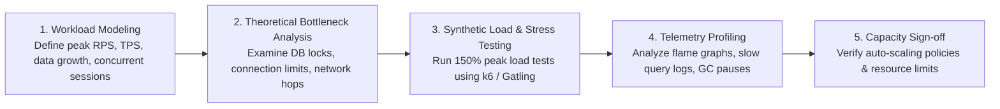
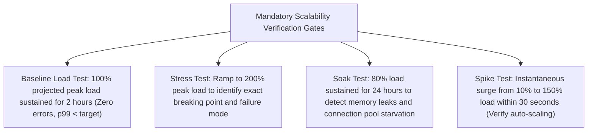

# Architecture Scalability & Performance Review Guide

## Overview

The Architecture Scalability and Performance Review evaluates a system's capacity to handle projected production workloads, traffic spikes, and multi-year data growth without performance degradation, resource exhaustion, or unreasonable cloud expenditure.

Conducted by Solution Architects in coordination with **Site Reliability Engineering (SRE)** and Performance Testing leads, this review verifies that all theoretical scale models have been empirically validated through rigorous stress testing in pre-production environments.

---

## The Scalability Review Lifecycle



---

## Core Scalability Verification Areas

### 1. Compute Tier Scalability
- **Stateless Verification**: Are application containers completely stateless? Are session states externalized to distributed caches (Redis)?
- **Auto-Scaling Metrics**: Are Horizontal Pod Autoscalers (HPA) configured to scale based on appropriate metrics (e.g., CPU, memory, or custom metrics like Kafka consumer lag / SQS queue depth)?
- **Scale-Up Speed**: Can the compute tier scale from baseline to peak capacity in under **3 minutes** during sudden traffic spikes?

### 2. Database & Persistence Scalability
- **Connection Management**: Does the architecture utilize an intermediate connection pooler (PgBouncer, AWS RDS Proxy) to prevent database thread exhaustion under high container counts?
- **Query Plan Execution**: Have all critical path queries undergone `EXPLAIN ANALYZE` execution? Are full table scans eliminated on tables exceeding 10,000 rows?
- **Read/Write Segregation**: Are read-heavy queries routed to dedicated read-replicas, keeping the primary instance reserved exclusively for writes?
- **Sharding & Partitioning Readiness**: If the primary table will exceed 500 million rows, is a sharding or horizontal partitioning scheme (`PARTITION BY RANGE/HASH`) implemented?

### 3. Caching & Edge Topologies
- **Cache Invalidation Strategy**: Is the caching pattern clearly defined (Cache-Aside, Write-Through, Refresh-Ahead)? Are TTLs configured to prevent memory exhaustion?
- **Cache Stampede Protection**: Are locks, mutexes, or probabilistic early expiration algorithms (XFetch) implemented to prevent backend crashes when hot cache keys expire?
- **CDN Edge Offloading**: Is static content and cacheable REST JSON offloaded to an edge CDN (Cloudflare/CloudFront) to reduce origin egress bandwidth?

---

## Mandatory Load Testing Gates

Prior to scalability sign-off, the engineering team must provide empirical test results from a staging environment mirrored to production scale:



---

## Scalability Sign-Off Determination Template

```markdown
### Architecture Scalability Sign-Off: APPROVED
- **System**: Order Ingestion & Routing Platform (OIR-102)
- **Reviewer**: Lead SRE Architect
- **Date**: 2026-09-05

#### Empirical Benchmark Summary
- **Target Peak Throughput**: 5,000 write TPS / 25,000 read QPS
- **Achieved Load Test Throughput**: **7,500 write TPS / 35,000 read QPS (150% of target)**
- **Observed Latency (p95)**: 45ms (Target: < 100ms)
- **Observed Latency (p99)**: 110ms (Target: < 200ms)
- **Database CPU Utilization at Peak**: 48% on primary, 32% on read-replicas
- **Auto-Scaling Performance**: Provisioned 12 new worker pods in 85 seconds upon traffic surge

#### Residual Recommendations
- Configure automated weekly vacuuming on PostgreSQL `order_events` table to prevent index bloat.
```
