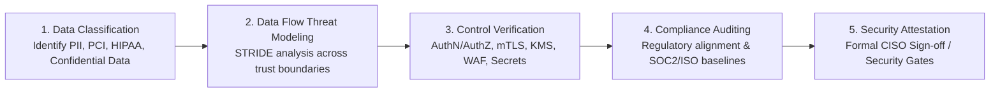

# Architecture Security Review Guide

## Overview

The Architecture Security Review is a specialized enterprise governance checkpoint dedicated to identifying security vulnerabilities, validating trust boundaries, evaluating cryptographic implementations, and ensuring regulatory compliance across proposed and evolving software systems.

Conducted in partnership with the **Chief Information Security Officer (CISO) organization** and SecOps leads, this review ensures that security is engineered directly into the system topology rather than discovered during pre-launch penetration testing.

---

## The Security Review Lifecycle



---

## Core Security Evaluation Domains

### 1. Identity & Access Management (IAM)
- **Authentication (AuthN)**: Is user authentication offloaded to an enterprise Identity Provider (IdP) via OIDC / SAML 2.0? Are multi-factor authentication (MFA) and biometric WebAuthn supported?
- **Authorization (AuthZ)**: Is authorization enforced using Role-Based (RBAC) or Attribute-Based Access Control (ABAC)? Is authorization checked on **every single request** at the controller layer?
- **Workload Identity**: Do internal microservices communicate using cryptographic identities (SPIFFE/SPIRE, AWS IAM Roles for Service Accounts - IRSA) rather than long-lived API keys?

### 2. Cryptographic Architecture & Data Protection
- **In-Transit Encryption**: Is TLS 1.3 enforced for public ingress? Are legacy insecure cipher suites (RC4, 3DES, TLS 1.0/1.1) blocked? Is internal inter-service traffic encrypted via Mutual TLS (mTLS)?
- **At-Rest Encryption**: Are all database storage volumes, EBS disks, and S3 object buckets encrypted with AES-256 using Customer Managed Keys (CMKs) in AWS KMS / HashiCorp Vault?
- **Data Tokenization & Masking**: Are payment card numbers tokenized prior to entering core application boundaries? Are credit card numbers and passwords automatically masked in log outputs?

### 3. Attack Surface & Perimeter Defense
- **DDoS & Web Exploits**: Is an enterprise Web Application Firewall (Cloudflare / AWS WAF) placed in front of public endpoints to mitigate SQL injection, Cross-Site Scripting (XSS), and Layer 7 volumetric floods?
- **Network Micro-Segmentation**: Are backend services deployed inside private VPC subnets with zero direct public internet routability? Are egress connections filtered through controlled NAT gateways with domain whitelisting?

### 4. Secrets Management & Software Supply Chain
- **Zero Hardcoded Credentials**: Are static passwords, database strings, and API secrets completely banned from source repositories, environment configs, and Docker images?
- **Automated Scanning**: Are pre-commit hooks and CI pipelines equipped with static secret scanners (TruffleHog), SAST (SonarQube/Checkmarx), and Software Composition Analysis (Snyk/Mend)?

---

## Security Review Determination Template

```markdown
### Architecture Security Review Determination: APPROVED WITH REMEDIATIONS
- **System**: Customer Identity & Profile Service (ID-402)
- **Security Lead Reviewer**: Jane Smith (Enterprise Security Architect)
- **Date**: 2026-09-05

#### Identified Risks & Required Remediations
1. **SEC-RISK-01 (High)**: Admin API endpoint lacks rate limiting, vulnerable to credential stuffing.
   - *Mandated Fix*: Implement Token Bucket rate limiter (max 5 requests/minute per IP) at the API Gateway before production launch.
2. **SEC-RISK-02 (Critical)**: S3 bucket holding user tax forms lacks object lock and default KMS encryption.
   - *Mandated Fix*: Enable S3 Object Lock (WORM) and apply AWS KMS CMK encryption policy in Terraform scripts.
```
