# Deliverable Selection Guide

## 1. Decision Question: "Which Architecture Document Should I Create?"

Not every software project requires all 20 deliverables. Producing unnecessary documentation creates friction; under-documenting introduces catastrophic operational and security risks. 

Use this guide to determine the exact minimum viable set of architecture artifacts required for your initiative.

---

## 2. Interactive Decision Tree

```mermaid
flowchart TD
    START{What is the primary need or trigger?}
    
    START -->|Define product scope & user value| PRD["13-prd/ (PRD)"]
    START -->|Define measurable system constraints| NFR["15-nfr/ (NFR Spec)"]
    START -->|Record a single architectural choice| ADR["01-adr/ (ADR)"]
    START -->|End-to-end multi-tier solution blueprint| SAD["02-sad/ (SAD)"]
    START -->|Subsystem engineering & service topology| HLD["03-hld/ (HLD)"]
    START -->|Class/module code-level structure| LLD["04-lld/ (LLD)"]
    START -->|System-to-system contract| PROTO{What type of contract?}
    START -->|Specialized domain design| SPEC{Which domain?}
    START -->|Organizational governance & lifecycle| GOV{What governance event?}
    
    PROTO -->|REST / GraphQL / gRPC| APID["05-api-design/"]
    PROTO -->|Database & schema model| DATAD["06-data-design/"]
    PROTO -->|Enterprise messaging & ETL| INTD["07-integration-design/"]
    
    SPEC -->|Threat model & identity| SECD["08-security-design/"]
    SPEC -->|Cloud infrastructure & K8s| DEPD["09-deployment-design/"]
    SPEC -->|Disaster recovery & failover| DRD["18-disaster-recovery/"]
    SPEC -->|Legacy transformation| MODD["17-modernization-plan/"]
    SPEC -->|Data / system cutover| MIGD["16-migration-plan/"]
    
    GOV -->|Formal ARB milestone approval| ARBD["10-architecture-review/"]
    GOV -->|Track architectural uncertainty| RISKD["11-risk-register/"]
    GOV -->|Reusable standard pattern| REFD["12-reference-architecture/"]
    GOV -->|Operational handoff to SRE| ORRD["19-operational-readiness/"]
    GOV -->|Final production go/no-go gate| PRRD["20-production-readiness/"]
    
    style START fill:#f6e05e,stroke:#b7791f,stroke-width:2px,color:#000
    style SAD fill:#3182ce,stroke:#2b6cb0,stroke-width:2px,color:#fff
    style HLD fill:#3182ce,stroke:#2b6cb0,stroke-width:2px,color:#fff
    style ADR fill:#e53e3e,stroke:#9b2c2c,stroke-width:2px,color:#fff
```

---

## 3. Situational Selection Matrix

| Scenario / Trigger | Primary Deliverable | Supporting Deliverables | Justification |
|---|---|---|---|
| **Evaluating a new database, cloud service, or framework** | [01-adr/](01-adr/README.md) | [11-risk-register/](11-risk-register/README.md) | Captures trade-offs, options considered, and operational consequences without writing a full system design. |
| **Greenfield enterprise system launch** | [02-sad/](02-sad/README.md) | [14-requirements/](14-requirements/README.md), [15-nfr/](15-nfr/README.md), [03-hld/](03-hld/README.md), [08-security-design/](08-security-design/README.md) | Comprehensive multi-view architecture needed to align cross-functional stakeholders, business leaders, and engineers. |
| **New microservice / subsystem within existing platform** | [03-hld/](03-hld/README.md) | [05-api-design/](05-api-design/README.md), [06-data-design/](06-data-design/README.md), [09-deployment-design/](09-deployment-design/README.md) | Focuses strictly on the service boundary, component interactions, persistence, and runtime without repeating enterprise context. |
| **Complex internal module / algorithm / billing engine** | [04-lld/](04-lld/README.md) | [01-adr/](01-adr/README.md) | Guides engineers on class hierarchy, concurrency handling, error models, and transactional rollback mechanisms. |
| **Exposing public or partner integrations** | [05-api-design/](05-api-design/README.md) | [08-security-design/](08-security-design/README.md) | Enforces OpenAPI specs, authentication (OAuth2/mTLS), rate limiting, pagination, and error contract semantics. |
| **Migrating relational DB to distributed NoSQL / Sharding** | [06-data-design/](06-data-design/README.md) | [16-migration-plan/](16-migration-plan/README.md), [01-adr/](01-adr/README.md) | Addresses partition keys, indexing, consistency models, CDC replication, and data reconciliation. |
| **Connecting SaaS applications to core enterprise backends** | [07-integration-design/](07-integration-design/README.md) | [08-security-design/](08-security-design/README.md), [11-risk-register/](11-risk-register/README.md) | Details async queues, retries, dead-letter queues, webhook validation, and failure isolation. |
| **Decomposing a monolithic legacy application** | [17-modernization-plan/](17-modernization-plan/README.md) | [16-migration-plan/](16-migration-plan/README.md), [03-hld/](03-hld/README.md), [01-adr/](01-adr/README.md) | Establishes 7R assessment, Strangler Fig interception layers, wave schedules, and rollback plans. |
| **High-availability Tier-1 mission-critical compliance** | [18-disaster-recovery/](18-disaster-recovery/README.md) | [09-deployment-design/](09-deployment-design/README.md), [15-nfr/](15-nfr/README.md) | Formulates BIA, RTO/RPO targets, multi-region active-active/passive topologies, and game-day failover scripts. |
| **Preparing for pre-launch production release** | [20-production-readiness/](20-production-readiness/README.md) | [19-operational-readiness/](19-operational-readiness/README.md), [10-architecture-review/](10-architecture-review/README.md) | Executes Go/No-Go evaluation covering security scanning, load testing, telemetry dashboards, and on-call runbooks. |

---

## 4. Project Sizing & Deliverable Tailoring

Documentation depth should scale with project complexity and risk:

### Level 1: Low Complexity / Minor Internal Service
* **Required**: [01-adr/](01-adr/README.md) (for non-standard choices), [05-api-design/](05-api-design/README.md) (if providing endpoints), [20-production-readiness/](20-production-readiness/README.md) (standard checklist).
* **Optional**: HLD.

### Level 2: Medium Complexity / Standard Feature / Subsystem
* **Required**: [03-hld/](03-hld/README.md), [05-api-design/](05-api-design/README.md), [06-data-design/](06-data-design/README.md), [09-deployment-design/](09-deployment-design/README.md), [19-operational-readiness/](19-operational-readiness/README.md), [20-production-readiness/](20-production-readiness/README.md), [01-adr/](01-adr/README.md).

### Level 3: High Complexity / Greenfield Enterprise Platform / Regulated System
* **Full Suite**: [13-prd/](13-prd/README.md) $
ightarrow$ [14-requirements/](14-requirements/README.md) $
ightarrow$ [15-nfr/](15-nfr/README.md) $
ightarrow$ [02-sad/](02-sad/README.md) $
ightarrow$ [03-hld/](03-hld/README.md) $
ightarrow$ [08-security-design/](08-security-design/README.md) $
ightarrow$ [09-deployment-design/](09-deployment-design/README.md) $
ightarrow$ [18-disaster-recovery/](18-disaster-recovery/README.md) $
ightarrow$ [10-architecture-review/](10-architecture-review/README.md) $
ightarrow$ [20-production-readiness/](20-production-readiness/README.md).
