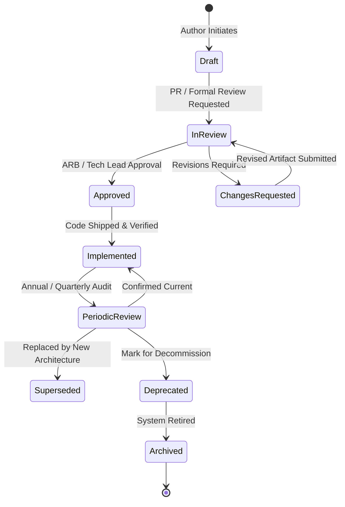

# Architecture Documentation Lifecycle

## 1. Overview

Architecture documentation is a living asset. Documentation that falls out of sync with running production systems is technical debt. This lifecycle defines the formal workflow through which every architecture deliverable is proposed, reviewed, approved, implemented, audited, and eventually retired.



---

## 2. Lifecycle States

| State | Definition | Permitted Modifications | Required Approvers |
|---|---|---|---|
| **Draft** | Work-in-progress artifact being drafted by the lead architect. | Full write access by author and contributors. | Author |
| **In Review** | Finalized draft undergoing formal peer, security, or Architecture Review Board (ARB) review. | Edits restricted to addressing review feedback. | Solution Architect, Lead Engineer |
| **Approved** | Formally accepted architecture blueprint. Authorizes engineering implementation. | Minor clarifications only; architectural changes require an amendment or new ADR. | ARB, Enterprise Architect, Domain Head |
| **Implemented** | The system described in the document is deployed and running in production. | Only operational updates (e.g., endpoints, runbook links). | Engineering Manager, Tech Lead |
| **Superseded** | The architecture has been replaced by a newer version or successor document. | Read-only. Must contain header link pointing to superseding document. | Enterprise Architect |
| **Deprecated** | The system or technology is designated for phase-out and decommission. | Read-only. Must indicate deprecation timeline and decommission date. | Enterprise Architect |
| **Archived** | The underlying system has been decommissioned. Preserved strictly for historical and audit purposes. | Locked / Read-only. | Archival / Compliance Lead |

---

## 3. Governance Workflows

### 3.1 Initial Creation to Approval
1. **Repository Setup**: Copy the appropriate template from `16-architecture-deliverables/templates/` into the project repository.
2. **Metadata Header**: Populate the standard metadata block (Owner, Reviewers, Document ID, Status: `Draft`).
3. **Drafting Phase**: Fill out context, requirements, architecture models, security boundaries, and operational characteristics.
4. **Pre-Review Self-Audit**: Execute the document-specific checklist from `checklists/` to ensure zero placeholder omissions.
5. **Formal Review Submission**: Submit a Pull Request or formal review package to the ARB / Lead Reviewers. Update status to `In Review`.
6. **Resolution**: Address comments. Upon consensus, approvers sign off and status transitions to `Approved`.

### 3.2 Transition from Approved to Implemented
1. **Implementation Tracking**: The engineering team implements the system adhering to the approved design.
2. **Architecture Drift Gate**: If engineering constraints demand changes to core decisions (e.g., changing database engine or protocol), an **amendment ADR** must be created and linked before code merge.
3. **Production Readiness Sign-Off**: Following successful testing and deployment, update document status to `Implemented` and record the initial production release tag.

### 3.3 Periodic Review & Archival
* Every `Approved` and `Implemented` deliverable must specify a `next_review` date (typically 6 or 12 months).
* During periodic review, the assigned architect verifies:
  1. Does the document accurately reflect the running production topology?
  2. Have any linked ADRs been superseded?
  3. Are dependencies still supported by enterprise standards?
* If superseded, prepend a bold warning block with a direct hyperlink to the replacing artifact and set status to `Superseded`.

---

## 4. Document RACI Matrix

| Deliverable Type | Responsible (R) | Accountable (A) | Consulted (C) | Informed (I) |
|---|---|---|---|---|
| **ADR** | Proposing Engineer / Architect | Lead Architect | Impacted Teams, SecArch | Entire Engineering Org |
| **SAD** | Solution Architect | Enterprise Architect | SecArch, DataArch, DevOps, PM | Executive Sponsors, Engineering |
| **HLD** | Technical Architect | Solution Architect | Lead Engineers, SecArch | QA, DevOps, Support |
| **LLD** | Lead Software Engineer | Technical Architect | Peer Developers, DBA | QA Engineers |
| **API Design** | API Designer / Backend Lead | Technical Architect | Frontend, Mobile, External Clients | Technical Writers |
| **Security Design** | Security Architect | CISO / Head of Sec | SA, Platform Lead, Legal | Engineering Teams |
| **Deployment Design** | Platform / Cloud Architect | Head of Infrastructure | DevOps, SecArch, SRE | Engineering Teams |
| **Architecture Review** | ARB Chair / Secretary | Chief Architect | Domain Architects, SecArch | Project Stakeholders |
| **Production Readiness** | SRE Lead / Release Manager | Head of Engineering | SA, SecArch, Operations Lead | Executive Leadership |

---

## 5. Traceability Linkage Across Artifacts

To guarantee end-to-end auditability, every deliverable must maintain cross-references:

```text
[Business Driver / PRD-001]
          ↓
[Functional & NFR-001]
          ↓
[Solution Architecture / SAD-001 §4.2]
          ↓
[High-Level Design / HLD-001 §3.1]
          ↓
[Architecture Decision Record / ADR-0042]
          ↓
[Low-Level Design / LLD-001 §2.3]
          ↓
[Git Pull Request / Commit SHA / Jira Ticket]
          ↓
[Production Telemetry Dashboard / Prometheus Alert]
```
