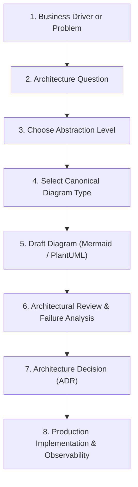

# 17. Architecture Diagrams & Visual Modeling Library

> **"A diagram without explicit boundaries, labeled protocols, and declared abstraction is merely art."**

Welcome to the **Master Architecture Diagram Library** of the `enterprise-architecture-handbook`. This directory serves as an authoritative, production-grade visual engineering repository designed for Solution Architects, Technical Architects, Enterprise Architects, and Principal Engineers.

---

## 1. Architectural Philosophy & Principles

Visual architecture is not decorative documentation—it is an engineering medium for **evaluating trade-offs, discovering failure modes, defining security perimeters, and driving consensus**.

### The 14 Immutable Visual Architecture Tenets
1. **One diagram, one primary question**: A diagram that answers everything answers nothing.
2. **Declare abstraction before modeling**: Never mix Kubernetes Pods with enterprise business capabilities.
3. **Show relationships, not decoration**: Every line must declare its transport protocol, serialization, and interaction mode.
4. **Prefer clarity over completeness**: Reduce cognitive load by scoping diagrams to clear sub-domains.
5. **Multiple perspectives over monolithic diagrams**: Combine Context, Container, Sequence, and Deployment views.
6. **Every diagram has an explicit audience**: Executive, engineering team, security auditor, or operations lead.
7. **Architectures must reflect runtime reality**: Avoid theoretical "happy path" diagrams that ignore retries and timeouts.
8. **Trust boundaries must be non-negotiable**: Every security diagram must visually mark identity and network perimeters.
9. **Data movement must be traceable**: Show ingress, transformation, storage, and egress with classification tags.
10. **Runtime topology is distinct from logical architecture**: Do not conflate component interactions with VM/Pod hosting.
11. **Vendor neutrality in conceptual models**: Model logical functions before mapping to cloud services.
12. **Consistent notation standards**: Use standard C4, UML, or declared legend styles.
13. **Diagrams exist to drive decisions**: A diagram should justify an ADR or validate a non-functional requirement.
14. **Diagrams are living code**: Maintain diagrams in code (Mermaid/PlantUML) alongside architecture documentation.

---

## 2. Master Navigation & Diagram Taxonomy

The library is organized into six core foundational categories, eight domain-specific visual packages, tooling references, and eleven complete industry vertical suites:

### Foundational Diagram Disciplines
- [**C4 Model Library**](./c4/README.md) — System Context, Containers, Components, Code, System Landscape, and Dynamic tracing.
- [**Sequence Diagrams**](./sequence/README.md) — Synchronous, asynchronous, API gateways, OAuth2/OIDC, payment rails, Sagas with compensation, and circuit breakers.
- [**Deployment Diagrams**](./deployment/README.md) — 3-Tier, Kubernetes clusters, Serverless, Multi-Region Active-Active, Hybrid Cloud, DR failover, and Edge.
- [**Network Diagrams**](./network/README.md) — Hub-and-Spoke, Transit VPC/VNet, Zero-Trust network perimeters, DMZs, WAFs, and PrivateLink topologies.
- [**Security Diagrams**](./security/README.md) — STRIDE threat modeling, trust boundaries, IAM, HashiCorp Vault secrets, PAM, and supply chain attestation.
- [**Data-Flow Diagrams**](./data-flow/README.md) — ETL/ELT pipelines, streaming event fabrics, Debezium CDC, Lakehouses, PII tokenization, and financial ledgers.

### Domain-Specific Architecture Packages
- [**Architecture Packages**](./architecture/README.md) — High-Level Design (HLD), Solution Architecture Document (SAD) packages, and [Diagram Anti-Patterns](./architecture/diagram-anti-patterns.md).
- [**Application Diagrams**](./application/README.md) — Clean Architecture, Hexagonal, Modular Monolith, Microservices, CQRS, and BFF.
- [**Integration Diagrams**](./integration/README.md) — REST, GraphQL, gRPC, Event-Driven Webhooks, Enterprise Service Bus, and Legacy Gateways.
- [**Data Topologies**](./data/README.md) — Operational vs Analytical, Polyglot persistence, Data Mesh, Caching, and Streaming Analytics.
- [**Cloud Architectures**](./cloud/README.md) — AWS, Azure, GCP, Multi-Cloud, Hybrid Landing Zones, and Cloud Security perimeters.
- [**DevOps Diagrams**](./devops/README.md) — CI/CD pipelines, GitOps pull reconciliation, Canary traffic splitting, and Internal Developer Platforms (IDPs).
- [**AI & Modern Systems**](./ai/README.md) — RAG fabrics, Multi-Agent workflows, AI Gateways, Model Serving, and AI Safety boundaries.
- [**Enterprise Architecture**](./enterprise/README.md) — Business-to-Tech mapping, Capability modeling, Application Portfolio Management (TIME), and Transformation roadmaps.

### Standards, Tooling & Industry Suites
- [**Diagramming Standard**](./diagramming-standard.md) — Enterprise modeling guidelines, naming conventions, and layout rules.
- [**Diagram Selection Guide**](./diagram-selection-guide.md) — Decision matrix and interactive tree answering *"Which diagram do I need?"*
- [**Diagram Review Checklist**](./diagram-review-checklist.md) — 50-point Architecture Review Board (ARB) quality gate.
- [**Mermaid Syntax Library**](./mermaid/README.md) — Flowcharts, sequence, class, state, and GitOps visual conventions.
- [**PlantUML Library**](./plantuml/README.md) — C4-PlantUML extensions, layout directives, and enterprise component themes.
- [**Raw Template Library**](./templates/) — Copy-pasteable `.mmd` and `.puml` starter files.
- [**Industry Vertical Examples**](./examples/README.md) — 11 complete multi-diagram enterprise suites (Banking, E-Commerce, Healthcare, SaaS, Telecom, etc.).

---

## 3. Mermaid vs PlantUML Decision Matrix

| Dimension | Mermaid | PlantUML | Recommended Choice |
| :--- | :--- | :--- | :--- |
| **Native Markdown Rendering** | Rendered natively on GitHub, GitLab, and most Markdown previewers without external server plugins. | Requires Java runtime, Graphviz, or remote PlantUML rendering server. | **Mermaid** for documentation living directly in Git repos. |
| **C4 Model Precision** | Subgraph grouping mimics C4; lacks native C4-specific styling tokens. | First-class native C4 library (`C4_Context`, `C4_Container`, `C4_Component`). | **PlantUML** for formal C4 architecture reviews and ARB packages. |
| **Complex Sequence Logic** | Supports loops, alt/opt fragments, notes, and parallel blocks. | Superior support for complex activation lifelines, delays, dividers, and styling. | **PlantUML** for intricate distributed failure mode analysis. |
| **Maintenance & Git Diffs** | Extremely lightweight text format; concise syntax; frictionless PR reviews. | Slightly more verbose; requires standard includes and macro definitions. | **Mermaid** for team-level agility and continuous delivery. |
